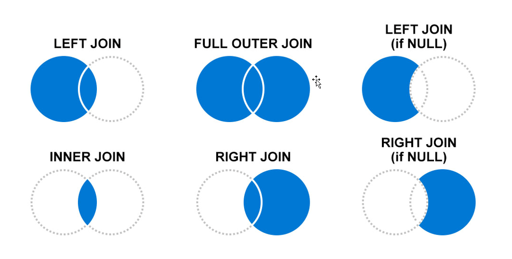

The join operator merges the rows of two tables to form a new table by matching the specified columns' values from each table.

Syntax

LeftTable | join [JoinParameters] ( RightTable ) on Attributes

```kusto
SecurityEvent 

| where EventID == "4624" 

| summarize LogOnCount=count() by EventID, Account 

| project LogOnCount, Account 

| join kind = inner (

     SecurityEvent 

     | where EventID == "4634" 

     | summarize LogOffCount=count() by EventID, Account 

     | project LogOffCount, Account 

) on Account

```

The first table specified in the join is considered the Left table.  The table after the join keyword is the right table.  When working with columns from the tables, the `$left.Column` name and `$right.Column` name is to distinguish which tables column are referencing.

When joining tables, you use Join flavors to determine the joining behavior.  It is essential to understand the impact of records on the left and right side based on the join flavor.  The graphic below shows which records will be kept if there is or isn't a matching record in the other dataset.  The **inner join** will only show records from the left side if there is a matching record on the right side. The right side will also require a left side record.



| Join Flavor| Output Records|
| :--- | :--- |
| kind=leftanti, kind=leftantisemi| Returns all the records from the left side that don't have matches from the right|
| kind=rightanti, kind=rightantisemi| Returns all the records from the right side that don't have matches from the left.|
| kind unspecified, kind=innerunique| Only one row from the left side is matched for each value of the on key. The output contains a row for each match of this row with rows from the right|
| kind=leftsemi| Returns all the records from the left side that have matches from the right.|
| kind=rightsemi| Returns all the records from the right side that have matches from the left.|
| kind=inner| Contains a row in the output for every combination of matching rows from left and right.|
| kind=leftouter (or kind=rightouter or kind=fullouter)| Contains a row for every row on the left and right, even if it has no match. The unmatched output cells contain nulls.|

