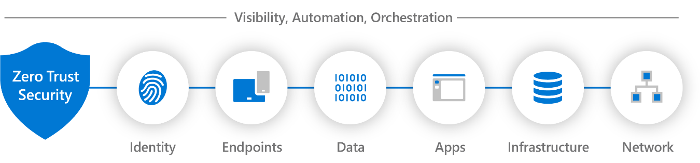
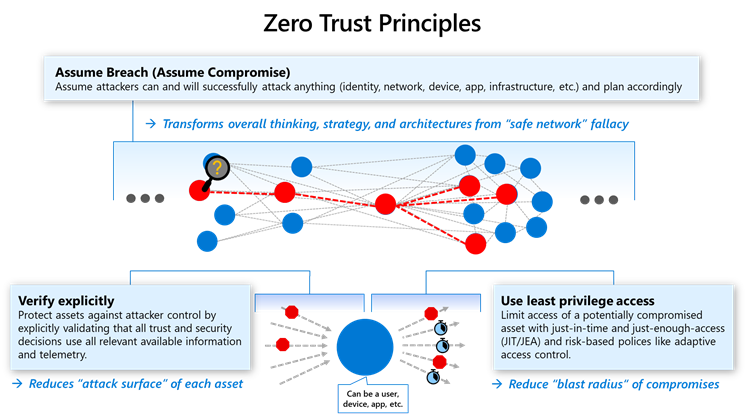

Today, organizations need a new security model that effectively adapts to the complexity of the modern environment, embraces the mobile workforce, and protects people, devices, applications, and data wherever they're located.

This is the core of **Zero Trust**. Instead of believing everything behind the corporate firewall is safe, the Zero Trust model assumes breach, and verifies each request as though it originated from an uncontrolled network. Regardless of where the request originates or what resource it accesses, the Zero Trust model teaches us to "never trust,always verify."

### Guiding principles of Zero Trust

**Verify explicitly** - Protect assets against attacker control by explicitly validating that all trust and security decisions use all relevant available information and telemetry. | Limit access of a potentially compromised asset with just-in-time and just-enough-access (JIT/JEA) and risk-based polices like adaptive access control. | Assume attackers can and will successfully attack anything in the system (identity, network, device, app, infrastructure, etc.) and plan accordingly. |

**Use least privilege access** - A Zero Trust approach should extend throughout the entire digital estate and serve as an integrated security philosophy and end-to-end strategy. This is done by implementing Zero Trust controls and technologies across six foundational elements. Each of these is a source of signal, a control plane for enforcement, and a critical resource to be defended.

**Assume breach** - Different organizational requirements, existing technology implementations, and security stages all affect how a Zero Trust security model implementation is planned. Using our experience in helping customers to secure their organizations, as well as in implementing our own Zero Trust model, we've developed the following guidance to assess your readiness and to help you build a plan to get to Zero Trust.

### Technology pillars of Zero Trust

The Zero Trust approach can be organized around key technological pillars:

* **Secure identity with Zero Trust** - Identities, whether they represent people, services, or IoT devices—define the Zero Trust control plane. When an identity attempts to access a resource, verify that identity with strong authentication, and ensure access is compliant and typical for that identity. Follow
least privilege access principles.

* **Secure endpoints with Zero Trust** - Once an identity has been granted access to a resource, data can flow to a variety of different endpoints—from IOT devices to smartphones, BYOD to partner-managed devices,
and on-premises workloads to cloud-hosted servers. This diversity creates a massive attack surface area. Monitor and enforce device health and compliance for secure access.

* **Secure applications with Zero Trust** - Applications and APIs provide the interface by which data is consumed. They may be legacy on-premises, lifted-and-shifted to cloud workloads, or modern SaaS applications. Apply controls and technologies to discover shadow IT, ensure appropriate in-app permissions,
ate access based on real-time analytics, monitor for abnormal behavior, control user actions, and validate secure configuration options.

* **Secure data with Zero Trust** - Ultimately, security teams are protecting data. Where possible, data should remain safe even if it leaves the devices, apps, infrastructure, and networks the organization controls. Classify, label, and encrypt data, and restrict access based on those attributes.

* **Secure infrastructure with Zero Trust** - Infrastructure—whether on-premises servers, cloud-based VMS, containers, or micro-services — represents a critical threat vector. Assess version, configuration, and JIT access to harden defense. Use telemetry to detect attacks and anomalies, and automatically block and flag risky behavior and take protective actions.

* **Secure networks with Zero Trust** - All data is ultimately accessed over network infrastructure. Networking controls can provide critical controls to enhance visibility and help prevent attackers from moving laterally across the network. Segment networks (and do deeper in-network micro-segmentation) and
deploy real-time threat protection, end-to-end encryption, monitoring, and analytics.

* **Visibility, automation, and orchestration with Zero Trust** - In our Zero Trust guides, we define the approach to implement an end-to-end Zero Trust methodology across identities, endpoints and devices, data, apps, infrastructure, and network. These activities increase your visibility, which gives you better data for making trust decisions. With each Of these individual areas generating their own relevant alerts, we
need an integrated capability to manage the resulting influx Of data to better defend against threats and validate trust in a transaction.

The following diagram visually illustrates the zero trust principles:

