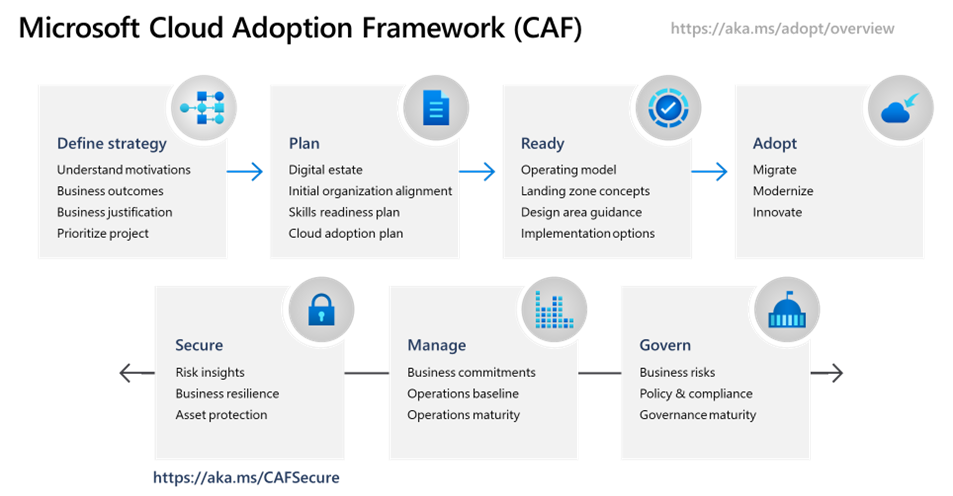

The most successful transformation journeys start with business goals. Cloud adoption can be a costly and time-consuming effort. Fostering the right level of support from IT and other areas of the business is crucial to success. Microsoft has created a [Cloud Adoption Framework](https://docs.microsoft.com/azure/cloud-adoption-framework/) to help customers identify business outcomes that are concise, defined, and drive observable results or change in business performance, supported by a specific measures.

## Cloud Adoption Framework

As mentioned in the video, Cloud Adoption Framework consists of tools, documentation, and proven practices. The Cloud Adoption Framework includes these stages:

-  Define your strategy
-  Make a plan
-  Ready your organization
-  Adopt the cloud
-  Govern and manage your cloud environments

The govern stage focuses on cloud governance. You can refer to the Cloud Adoption Framework for recommended guidance as you build your cloud governance strategy.

To help build your adoption strategy, the Cloud Adoption Framework breaks out each stage into further exercises and steps. Let's take a brief look at each stage.

### Define your strategy

Here, you answer why you're moving to the cloud and what you want to get out of cloud migration. Do you need to scale to meet demand or reach new markets? Will it reduce costs or increase business agility? When defining your cloud business strategy, you should understand [cloud economics](https://azure.microsoft.com/overview/cloud-economics) and consider the business impact, turnaround time, global reach, performance, and more. Here are the steps to define your cloud strategy:

1. **Define and document motivations**: Meeting with stakeholders and leadership can help you answer why you're moving to the cloud.
1. **Document business outcomes**: Meet with leadership from finance, marketing, sales, and human resource groups to help you document your goals.
1. **Evaluate financial considerations**: Measure objectives and identify the return expected from a specific investment.
1. **Understand technical considerations**: Evaluate technical considerations through the selection and completion of your first technical project.

### Make a plan

Here, you build a plan that maps your aspirational goals to specific actions. A good plan helps ensure that your efforts map to the desired business outcomes. Here are steps to build a solid plan:

1. **Digital estate**: Create an inventory of the existing digital assets and workloads that you plan to migrate to the cloud.
1. **Initial organizational alignment**: Ensure the right people are involved in migration efforts, both from a technical standpoint as well as from a cloud governance standpoint.
1. **Skills readiness plan**: Build a plan that helps individuals build the skills they need to operate in the cloud.
1. **Cloud adoption plan**: Build a comprehensive plan that brings together the development, operations, and business teams toward a shared cloud adoption goal.

### Ready your organization

Here, you create a *landing zone* or an environment in the cloud to begin hosting your workloads. Here are steps to ready your organization:

1. **Azure setup guide**: Review the Azure setup guide to become familiar with the tools and approaches you need to use to create a landing zone.
1. **Azure landing zone**: Begin to build out the Azure subscriptions that support each of the major areas of your business. A landing zone includes cloud infrastructure as well as governance, accounting, and security capabilities.
1. **Expand the landing zone**: Refine your landing zone to ensure that it meets your operations, governance, and security needs.
1. **Best practices**: Start with recommended and proven practices to help ensure that your cloud migration efforts are scalable and maintainable.

### Adopt the cloud

Here, you begin to migrate your applications to the cloud. Along the way, you might find ways to modernize your applications and build innovative solutions that use cloud services. The Cloud Adoption Framework breaks this stage into two parts: migrate and innovate.

#### Migrate 

Here are the steps in the migrate process of this stage:

1. **Migrate your first workload**: Use the Azure migration guide to deploy your first project to the cloud.
1. **Migration scenarios**: Use additional in-depth guides to explore more complex migration scenarios.
1. **Best practices**: Check in with the Azure cloud migration best practices checklist to verify that you're following recommended practices.
1. **Process improvements**: Identify ways to make the migration process scale while requiring less effort.

#### Innovate 

Here are the steps in the innovate process of this stage:

1. **Business value consensus**: Verify that investments in new innovations add value to the business and meet customer needs.
1. **Azure innovation guide**: Use this guide to accelerate development and build a minimum viable product (MVP) for your idea.
1. **Best practices**: Verify that your progress maps to recommended practices before moving forward.
1. **Feedback loops**: Check in frequently with your customers to verify that you're building what they need.

#### Govern and manage your cloud environments

Here, you begin to form your cloud governance and cloud management strategies. As the cloud estate changes over time, so do cloud governance processes and policies. You need to create resilient solutions that are constantly optimized.

#### Govern 

Here are the steps in the govern process of this stage:

1. **Methodology**: Consider your end state solution. Then define a methodology that incrementally takes you from your first steps all the way to full cloud governance.
1. **Benchmark**: Use the [governance benchmark tool](https://cafbaseline.com/) to assess your current state and future state to establish a vision for applying the framework.
1. **Initial governance foundation**: Create a Minimum Viable Product (MVP) that captures the first steps of your governance plan.
1. **Improve the initial governance foundation**: Iteratively add governance controls that address tangible risks as you progress toward your end state solution.

#### Manage 

Here are the steps in the manage process of this stage:

1. **Establish a management baseline**: Define your minimum commitment to operations management. A management baseline is the minimum set of tools and processes that should be applied to every asset in an environment.
1. **Define business commitments**: Document supported workloads to establish operational commitments with the business and agree on cloud management investments for each workload.
1. **Expand the management baseline**: Apply recommended best practices to iterate on your initial management baseline.
1. **Advanced operations and design principles**: For workloads that require a higher level of business commitment, perform a deeper architecture review to deliver on your resiliency and reliability commitments.
