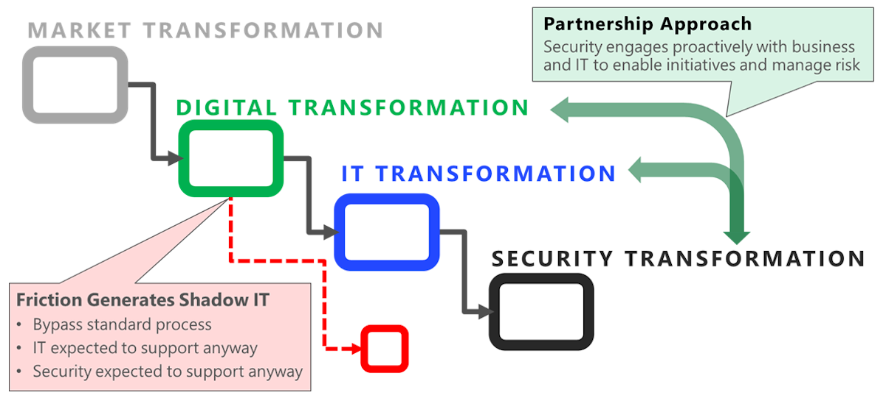

Many organizations are managing a chain of multiple simultaneous
transformations in the organization. These internal transformations
typically start because nearly all external markets are transforming to
meet new customer preferences for mobile and cloud technologies.
Organizations often face the competitive threat of new startups and the
digital transformation of traditional competitors who can disrupt the
market.

The internal transformation process typically includes:

-   **Digital transformation** of the business to capture new
     opportunities and stay competitive against digital native startups
-   **Technology transformation** of the IT organization to support the initiative with cloud services, modernized development practices, and related changes
-   **Security transformation** to both adapt to the cloud and simultaneously address an increasingly sophisticated threat environment

## Security design principles

Based on the organization's security transformation; enforcing security
design principles is key to enforcing a Zero Trust architecture.
Security design principles describe a securely architected system hosted
on cloud or on-premises datacenters (or a combination of both).
Application of these principles dramatically increases the likelihood
your security architecture assures confidentiality, integrity, and
availability.

To assess workloads using the tenets found in the Azure Well-Architected
Framework, reference the [Microsoft Azure Well-Architected Review](/assessments/?id=azure-architecture-review&mode=pre-assessment).

The following design principles provide:

-   Context for questions
-   Why a certain aspect is important
-   How an aspect is applicable to security

These critical design principles are used as lenses to assess the
Security of an application deployed on Azure. These lenses provide a
framework for the application assessment questions.

## Plan resources and how to harden them

Recommendations:

-   Consider security when planning workload resources
-   Understand how individual cloud services are protected
-   Use a service enablement framework to evaluate

## Automate and use least privilege

Recommendations:

-   Implement least privilege throughout the application and control plane to protect against data exfiltration and malicious actor scenarios
-   Drive automation through DevSecOps to minimize the need for human interaction

## Classify and encrypt data

Recommendations:

-   Classify data according to risk
-   Apply industry-standard encryption at rest and in transit, which ensures keys and certificates are stored securely and managed properly

## Monitor system security, plan incident response

Recommendations:

-   Correlate security and audit events to model application health
-   Correlate security and audit events to identify active threats
-   Establish automated and manual procedures to respond to incidents
-   Use security information and event management (SIEM) tooling for tracking

## Identify and protect endpoints

Recommendations:

-   Monitor and protect the network integrity of internal and external endpoints through security appliances or Azure services, such a firewalls and web application firewalls
-   Use industry standard approaches to protect against common attack vectors, such as distributed denial of service (DDoS) attacks like SlowLoris.

## Protect against code-level vulnerabilities

Recommendations:

-   Identify and mitigate code-level vulnerabilities, such as cross-site scripting and structured query language (SQL) injection.
-   In the operational lifecycle, regularly incorporate:
    -   Security fixes
    -   Codebase and dependency patching

## Model and test against potential threats

Recommendations:

-   Establish procedures to identify and mitigate known threats
-   Use penetration testing to verify threat mitigation
-   Use static code analysis to detect and prevent future vulnerabilities
-   Use code scanning to detect and prevent future vulnerabilities
