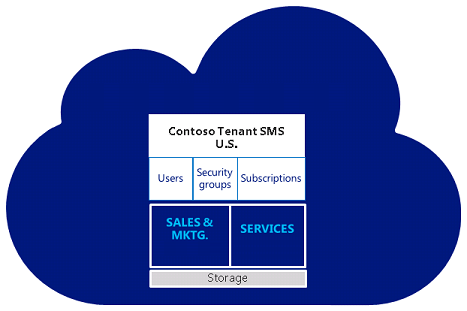

#### Planning and implementing a hybrid environment

A hybrid deployment offers organizations the ability to extend the
feature-rich experience and administrative control with their existing
on-premises environment to the cloud. A hybrid deployment provides a
single organization's seamless look and feel between an on-premises
and cloud environment. A hybrid deployment can also serve as an
intermediate step to moving completely to a cloud environment.

#### Implement a secure hybrid identity environment

Microsoft's identity solutions span on-premises and cloud-based
capabilities, creating a single user identity for authentication and
authorization to all resources, regardless of location. This concept is
known as Hybrid Identity. There are different design and configuration
options for hybrid identity using Microsoft solutions. In some cases, it
might be difficult to determine which combination will best meet an
organizations needs.

The following graphic shows an example of a hybrid identity solution
that enables IT Admins to integrate their current Windows Server Active
Directory solution located on-premises with Microsoft Azure Active
Directory to enable users to use Single Sign-On (SSO) across
applications located in the cloud and on-premises.

#### Implement a secure hybrid network

This reference architecture shows a secure hybrid network that extends
an on-premises network to Azure. The architecture implements a DMZ, also
called a *perimeter network*, between the on-premises network and an
Azure virtual network. All inbound and outbound traffic passes through
Azure Firewall.

 

#### Use multiple online environments or tenants

The customer engagement apps (Dynamics 365 Sales, Dynamics 365 Customer
Service, Dynamics 365 Field Service, Dynamics 365 Marketing, and
Dynamics 365 Project Service Automation) provide options for segregating
data and user access. For most companies, adding and using multiple
environments in a subscription provides the right mix of functionality
and ease of management. Enterprises with separate geographic locations
might consider using multiple tenants to separate licenses. Multiple
environments can share users among environments; multiple tenants
can't.

#### Uses for multiple environments

A typical deployment includes one tenant only. A tenant can include one
or more environments; however, an environment is always associated with
a single tenant.

This example uses two environments for three teams: Sales, Marketing,
and Services:

Sales and marketing share an environment so lead information can be
easily accessed by both. Services have their own environment, so tickets
and warranties can be managed separately from marketing campaigns and
other related sales events.

Access to one or both environments can be provided easily. Sales and
marketing users could be limited to their environment, while service
users with extended access could update support escalations records
related to accounts in both environments.

#### About single tenants with multiple environments:

-   Each environment within a tenant receives its own SQL database

-   Data isn't shared across environments

-   Go to [Microsoft Dataverse storage capacity](/power-platform/admin/capacity-storage) for help understanding how storage is shared across environments

-   All environments for a single customer tenant will be set up in the geography where they initially signed up for their account.Storage consumption is totaled and tracked across all the environments attached to a customer tenant

-   Separate security groups can be set up for all environments

-   A licensed user can potentially access all the environments associated with the tenant. Access is controlled by environment security group membership

-   Additional environments may be purchased through the Additional environment Add-On. Additional environments can only be added to \"paid\" subscriptions, and not trials or Internal Use Rights (IUR). If subscriptions are purchased through Volume Licensing, additional environments need to be purchased through a Large Account Reseller (LAR)

-   Existing trials or subscriptions can't be merged onto another environment; instead, data and customizations needed to move over

#### Uses for multi-tenants

Global businesses with different regional or country models can use
tenants to account for variations in approach, market size, or
compliance with legal and regulatory constraints.

This example includes a second tenant for Contoso Japan:

User accounts, identities, security groups, subscriptions, licenses, and
storage can't be shared among tenants. All tenants can have multiple
environments associated with each specific tenant. Data isn't shared
across environments or tenants.

In a **multi-tenant scenario**, a licensed user associated with a tenant
can only access one or more environments mapped to the same tenant. To
access another tenant, a user would need a separate license and a unique
set of sign-in credentials for that tenant.

For example, suppose User A has an account to access Tenant A. In that
case, their license allows them to access any and all environments
created within Tenant A -- if allowed by their administrator. If User A
needs to access environments within Tenant B, they will need an
additional license.

-   Each tenant requires Microsoft Power Platform admin(s) with unique sign-in credentials, and each tenant affiliate will manage its tenant separately in the administrator console

-   Multiple environments within a tenant are visible from the interface if the administrator has access

-   Licenses can't be reassigned between tenant enrollments. An enrolled affiliate can use license reduction under one enrollment and add licenses to another enrollment to facilitate this

-   On-premises Active Directory federation can't be established with more than one tenant unless there are top-level domains that need to be federated with different tenants (for example, Contoso.com and Fabricam.com)

#### Manage hybrid environments at scale with Azure Arc

Today, companies struggle to control and govern increasingly complex
environments that extend across data centers, multiple clouds, and edge
of a network boundry. Each environment and cloud possess its own set of
management tools, and new DevOps and ITOps operational models can be
hard to implement across resources.

Azure Arc simplifies governance and management by delivering a
consistent multi-cloud and on-premises management platform.

Azure Arc provides a centralized, unified way to:

-   Manage an entire environment by projecting existing non-Azure and/or on-premises resources into Azure Resource Manager

-   Manage virtual machines, Kubernetes clusters, and databases as if they are running in Azure

-   Use familiar Azure services and management capabilities, regardless of where they live

-   Continue using traditional ITOps while introducing DevOps practices to support new cloud native patterns in an environment

-   Configure custom locations as an abstraction layer on top of Azure Arc-enabled Kubernetes clusters and cluster extensions

 

#### Manage hybrid environments at scale with Azure Policy

Azure Policy helps to enforce organizational standards and to assess
compliance at-scale. Through its compliance dashboard, it provides an
aggregated view to evaluate the overall state of the environment, with
the ability to drill down to the per-resource, per-policy granularity.
It also helps to bring resources to compliance through bulk remediation
for existing resources and automatic remediation for new resources.

Common use cases for Azure Policy include implementing governance for
resource consistency, regulatory compliance, security, cost, and
management. Policy definitions for these common use cases are already
available in Azure environments as built-ins to help architects get
started.

Azure Policy uses a JavaScript Object Notation (JSON) format to form the
logic the evaluation uses to determine whether a resource is compliant
or not. Definitions include metadata and the policy rule. The defined
rule can use functions, parameters, logical operators, conditions, and
property aliases to match exactly specific scenarios. The policy rule
determines which resources in the scope of the assignment get evaluated.

Resources are evaluated at specific times during the resource lifecycle,
the policy assignment lifecycle, and for regular ongoing compliance
evaluation.

The following are the times or events that cause a resource to be
evaluated:

-   A resource is created or updated in a scope with a policy assignment

-   A policy or initiative is newly assigned to a scop

-   A policy or initiative already assigned to a scope is updated

-   During the standard compliance evaluation cycle, which occurs once every 24 hours
