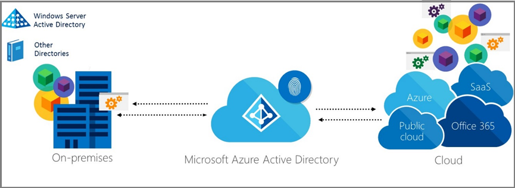
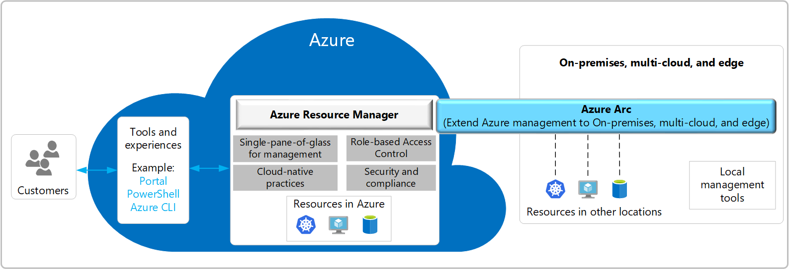

A hybrid deployment offers organizations the ability to extend the feature-rich experience and administrative control with their existing on-premises environment to the cloud. A hybrid deployment provides a single organization's seamless look and feel between an on-premises and cloud environment. A hybrid deployment can also serve as an intermediate step to moving completely to a cloud environment.

## Implement a secure hybrid identity environment

Microsoft's identity solutions span on-premises and cloud-based
capabilities, creating a single user identity for authentication and
authorization to all resources, regardless of location. This concept is
known as Hybrid Identity. There are different design and configuration
options for hybrid identity using Microsoft solutions. In some cases, it
might be difficult to determine which combination will best meet the needs of an
organization.

The following graphic shows an example of a hybrid identity solution
that enables IT Admins to integrate their current Windows Server Active
Directory solution located on-premises with Microsoft Azure Active
Directory to enable users to use Single Sign-on (SSO) across
applications located in the cloud and on-premises.

## Implement a secure hybrid network

This reference architecture shows a secure hybrid network that extends
an on-premises network to Azure. The architecture implements a DMZ, also
called a *perimeter network*, between the on-premises network and an
Azure virtual network. All inbound and outbound traffic passes through
Azure Firewall.

 

## Architecting for multitenant scenarios

In a multitenant architecture, you share some or all of your resources between tenants. This process means that a multitenant architecture can give you cost and operational efficiency. However, multitenancy introduces complexities, including the following:

* How do you define what a tenant is, for your specific solution? Does a tenant correspond to a customer, a user, or a group of users (like a team)?
* How will you deploy your infrastructure to support multitenancy, and how much isolation will you have between tenants?
* What level of service do you need to provide to your tenants? Consider performance, resiliency, security, and compliance requirements, like data residency.
* How do you plan to grow your business or solution, and will it scale to the number of tenants you expect?
* Do any of your tenants have unusual or special requirements? For example, does your biggest customer need higher performance or stronger guarantees than others?
* How will you monitor, manage, automate, scale, and govern your Azure environment, and how will multitenancy impact this?

## Tenancy models

There are two common models:

* **Business-to-business (B2B)**. If your customers are other organizations, you are likely to consider your tenants to be those customers. However, consider whether your customers might have divisions (teams or departments), or if they have a presence in multiple countries/regions. You may need to consider having a single customer map to multiple tenants, if there are different requirements for these subgroups. Similarly, a customer might want to maintain two instances of your service, so they can keep their development and production environments separated from each other. Generally, a single tenant will have multiple users. For example, all of your customer's employees will be users within the same tenant.
* **Business-to-consumer (B2C)**. If your customers are consumers, it's often more complicated to relate customers, tenants, and users. In some scenarios, each consumer could be their own tenant. However, consider whether your solution might be used by families, groups of friends, clubs, associations, or other groupings that might need to access and manage their data together. For example, a music-streaming service might support both individual users and families, and it might treat each of these account types differently, when it comes to separating them into tenants.

## Tenant isolation

One of the biggest considerations when designing a multitenant architecture is the level of isolation that each tenant needs. Isolation can mean different things:

* Having a single set of shared infrastructure, with separate instances of your application and separate databases for each tenant.
* Sharing some common resources, while keeping other resources separate for each tenant.
* Keeping data on a separate physical infrastructure. In the cloud, this might require separate Azure resources for each tenant, or it could even mean literally deploying a separate physical infrastructure, by using dedicated hosts.

Rather than thinking of isolation as being a discrete property, you should think about isolation as being a continuum. You can deploy components of your architecture that are more or less isolated than other components in the same architecture, depending on your requirements. The following diagram demonstrates a continuum of isolation:

:::image type="content" source="../media/isolated-shared.png" alt-text="Diagram showing the continuum of tenant isolation from fully isolated to fully shared." lightbox="../media/isolated-shared.png":::

For more information on architecture considerations for multitentant scenarios, see the following articles:

* [Architectural considerations for a multitenant solution](/azure/architecture/guide/multitenant/considerations/overview)
* [Tenancy models to consider for a multitenant solution](/azure/architecture/guide/multitenant/considerations/tenancy-models)

## Manage hybrid environments at scale with Azure Arc

Today, companies struggle to control and govern increasingly complex environments that extend across data centers, multiple clouds, and edge of a network boundary. Each environment and cloud possess its own set of management tools, and new DevOps and ITOps operational models can be hard to implement across resources.

Azure Arc simplifies governance and management by delivering a consistent multicloud and on-premises management platform.

Azure Arc provides a centralized, unified way to:

- Manage an entire environment by projecting existing non-Azure and/or on-premises resources into Azure Resource Manager
- Manage virtual machines, Kubernetes clusters, and databases as if they're running in Azure
- Use familiar Azure services and management capabilities, regardless of where they live
- Continue using traditional ITOps while introducing DevOps practices to support new cloud native patterns in an environment
- Configure custom locations as an abstraction layer on top of Azure Arc-enabled Kubernetes clusters and cluster extensions

 

## Manage hybrid environments at scale with Azure Policy

Azure Policy helps to enforce organizational standards and to assess
compliance at-scale. Through its compliance dashboard, it provides an
aggregated view to evaluate the overall state of the environment, with
the ability to drill down to the per-resource, per-policy granularity.
It also helps to bring resources to compliance through bulk remediation
for existing resources and automatic remediation for new resources.

Common use cases for Azure Policy include implementing governance for
resource consistency, regulatory compliance, security, cost, and
management. Policy definitions for these common use cases are already
available in Azure environments as built-ins to help architects get
started.

Azure Policy uses a JavaScript Object Notation (JSON) format to form the
logic the evaluation uses to determine whether a resource is compliant
or not. Definitions include metadata and the policy rule. The defined
rule can use functions, parameters, logical operators, conditions, and
property aliases to match exactly specific scenarios. The policy rule
determines which resources in the scope of the assignment get evaluated.

Resources are evaluated at specific times during the resource lifecycle,
the policy assignment lifecycle, and for regular ongoing compliance
evaluation.

The following are the times or events that cause a resource to be
evaluated:

- A resource is created or updated in a scope with a policy assignment
- A policy or initiative is newly assigned to a scope
- A policy or initiative already assigned to a scope is updated
- During the standard compliance evaluation cycle, which occurs once every 24 hours