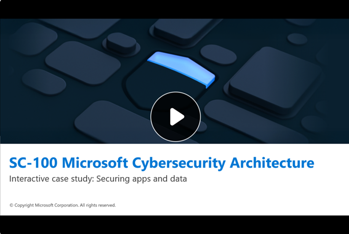

In this unit, you engage with the interactive case study focused on Fabrikam Inc., a fictitious e-commerce organization navigating application, and data security challenges in a multicloud environment.

### Scenario summary

Fabrikam Inc. operates across Azure and AWS, deploying microservices in AKS and EKS clusters. The organization faces fragmented DevOps security practices, including manual secret rotation, public database endpoints, and inconsistent CI/CD pipeline controls. These issues expose the organization to misconfigurations, credential leaks, and delayed threat detection—highlighting the need for integrated policy enforcement and unified visibility across cloud-native environments.

### Interactive case study structure

The structure of the interactive case study consists of the following five sections:

- **Animated Scenario**: Presents the context and challenges faced by a financial organization.
- **Hotspot Activity**: Allows you to uncover risks by exploring key areas in a visual environment.
- **Multiple-Choice Questions (MCQ)**: Challenges you to assess threats and identify vulnerabilities.
- **Drag-and-Drop Architecture Design**: Enables you to build a security solution using Microsoft technologies.
- **Carousel-Based Implementation Steps**: Visualizes how the solution would be deployed in a real-world setting.

Each component is designed to reinforce Zero Trust principles and promote architectural reasoning in multicloud application environments.

### Access the interactive case study

Use the image that follows to access the interactive case study, where you explore the scenario through a series of activities that simulate real-world decision-making and solution design.

> [!NOTE]
> It's recommended that you open the link in a new browser window. To do so, select the right mouse key and select the option.

