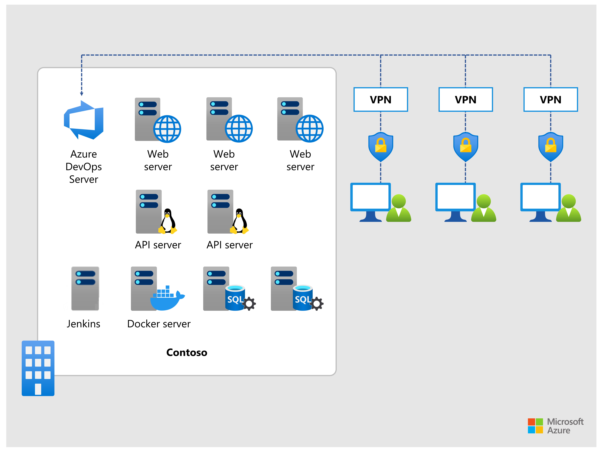

This unit presents the case study scenario, design requirements, conceptual and technical questions.

## Background scenario

Contoso is a recently founded online health supplements supplier in North America, with headquarters in Dallas, Texas, serving customers in the United States and Canada. The company relies exclusively on e-commerce, with no retail store presence. Therefore, the security and availability of their internet-based offerings are of utmost importance. Despite its online business model, Contoso hosts its infrastructure in a leased space of a local datacenter. 

The information technology (IT) department of Contoso comprises the development and operations teams. Developers build and update .NET and JavaScript-based web and mobile applications, including containerized backend APIs, for the steadily increasing customer base, with the focus on frequent releases of new and improved features. The operations team manages the web server and backend infrastructure hosting the applications, with the focus on maintaining their stability and minimizing downtime. The conflicting priorities of the two teams often lead to heated arguments between their members, especially since the operations team is also responsible for the deployment of new and updated code provided by the development team. 

These conflicts are further exacerbated by the Information Security (InfoSec) team, which frequently identifies vulnerabilities both in internally developed code and the infrastructure hosting it. As the InfoSec team constantly points out, these vulnerabilities result from the absence of proper development and design practices, insufficient oversight of the open-source software on which parts of Contoso's internally developed code are based, absence of configuration management tools, no dedicated staging environment, and lack of automation. Code development, build, and deployment involve many manual steps, with limited code reviews, testing, scanning, and monitoring. 

Developers work mostly from home using their personal computers with different versions of development tools installed, connecting to the company's datacenter space by using Point-to-Site VPN. Besides negative implications from the security standpoint, this arrangement further complicates efforts to standardize software development lifecycle.

Contoso relies on Azure DevOps Server for version control and application lifecycle management (ALM). Some of the more common automation tasks are implemented by using Jenkins. Web servers and SQL Server databases providing data persistence are hosted on servers running Windows Servers 2019. Web API components developed in JavaScript are hosted on servers running the current version of Linux Ubuntu. Container images for backend APIs are hosted in a Docker registry server.

To address the current development and operational issues, the CIO of Contoso laid out a plan to modernize the existing environment by transitioning to Microsoft Azure and fully embracing cloud-based DevSecOps practices. The plan includes replacing current processes with an automated continuous integration/continuous delivery (CI/CD) workflows and fully addressing security concerns. Despite the existing Azure DevOps Server installation, the decision was made to choose GitHub as the target platform for implementing the plan.

## Design requirements

The CIO of Contoso defined the following set of requirements that the technology team must address in its design of a cloud-based solution for application security: 

- Ensure that the footprint of the existing on-premises infrastructure is minimized or even replaced by Microsoft cloud-based managed services.
- Use the capabilities of GitHub and Microsoft Azure to rapidly build, test, and deploy new and updated applications in an automated manner, following the CI/CD principles.
- Implement controls that minimize the risk of unauthorized access to CI/CD workflows.
- Standardize the development environment and enhance its security with minimal administrative effort.
- Protect backend APIs from misuse.
- Minimize security risks associated with security vulnerabilities introduced into custom code, secrets checked into repositories, and the use of open-source software (OSS) components.
- Validate that applications deployed into the staging environment comply with the security standards before being deployed into the production environment.

## High-level conceptual questions

Before you start designing the solution based on Contoso's requirements, consider the following high-level conceptual questions:

- What are the two primary Microsoft-managed DevOps offerings?
- Which mechanisms provide support for the CI/CD functionality in the Microsoft-managed DevOps offerings?
- Which Microsoft cloud services contribute to enforcing DevSecOps practices when using GitHub for ALM?
- Which security standards should be considered for onboarding new applications?
- Which DevSecOps activities are most suitable in individual stages of CI/CD workflows?
- Which Microsoft Cloud services facilitate enhanced protection of Web Services APIs, including those hosted in on-premises and third-party cloud environments?
- How would you evaluate and enforce the compliance and security of applications deployed by using CI/CD workflows?

## Design questions

As you're architecting the solution based on the requirements of Contoso, answer the following design questions:

- Which Azure services would you consider as a replacement for the existing on-premises components of Contoso's infrastructure?
- Which GitHub features would you use to implement CI/CD functionality for Contoso?
- How would you minimize the risk of unauthorized use of CI/CD workflows for Contoso?
- What managed service could help you standardize the development environment for Contoso's development team?
- How would you enhance protection of backend APIs that are used by Contoso's web and mobile applications?
- What would you recommend to minimize security risks associated with security vulnerabilities introduced into custom code, secrets checked into repositories, and the use of open-source software (OSS) components in Contoso's applications?
- Which functionality would allow Contoso's developer and operations teams to validate that a new version of an application deployed into the staging environment complies with the security standards, before deploying it into the production environment? 