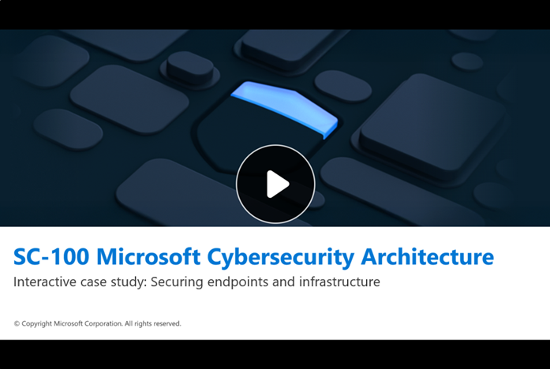

In this unit, you engage with the interactive case study focused on Litware Inc., a fictitious global manufacturing company, facing identity and data security challenges in a hybrid environment.

### Scenario summary

Litware Inc., a global manufacturer with more than 40 sites, is struggling with fragmented security across IT and OT environments. Regional autonomy has led to inconsistent governance, decentralized endpoint management, and delayed patching. Legacy industrial systems with default settings and flat networks increase exposure, while security telemetry is siloed in regional tools, creating blind spots. These conditions underscore the need for unified governance and Zero Trust principles to secure endpoints and infrastructure in a hybrid enterprise.

### Interactive case study structure

The structure of the interactive case study consists of the following five sections:

- **Animated Scenario**: Presents the context and challenges faced by a financial organization.
- **Hotspot Activity**: Allows you to uncover risks by exploring key areas in a visual environment.
- **Multiple-Choice Questions (MCQ)**: Challenges you to assess threats and identify vulnerabilities.
- **Drag-and-Drop Architecture Design**: Enables you to build a security solution using Microsoft technologies.
- **Carousel-Based Implementation Steps**: Visualizes how the solution would be deployed in a real-world setting.

Each component is designed to reinforce Zero Trust principles and promote architectural reasoning in hybrid identity environments.

### Access the interactive case study

Use the image that follows to access the interactive case study, where you explore the scenario through a series of activities that simulate real-world decision-making and solution design.

> [!NOTE]
> It's recommended that you open the link in a new browser window. To do so, select the right mouse key and select, "Open link in new window."

