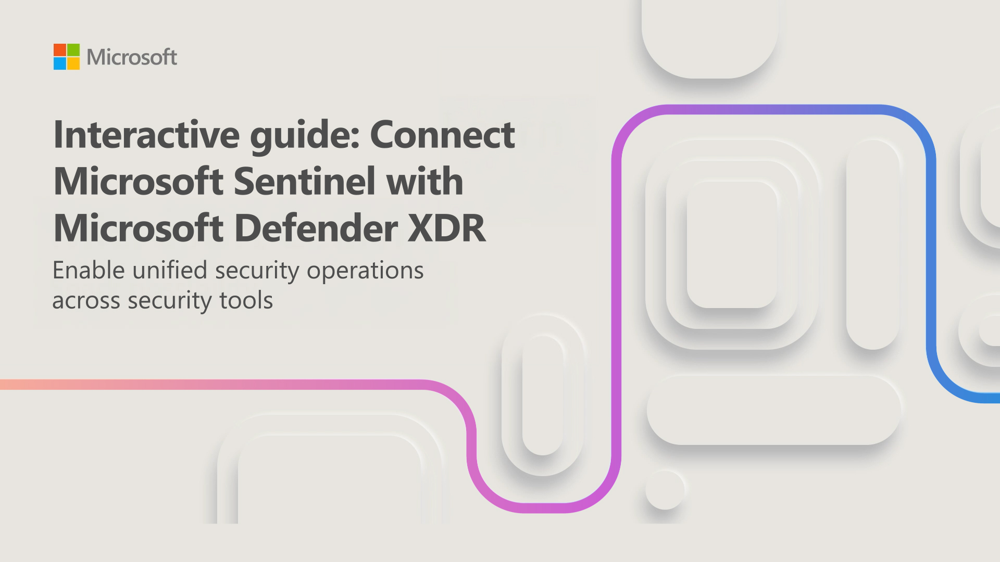
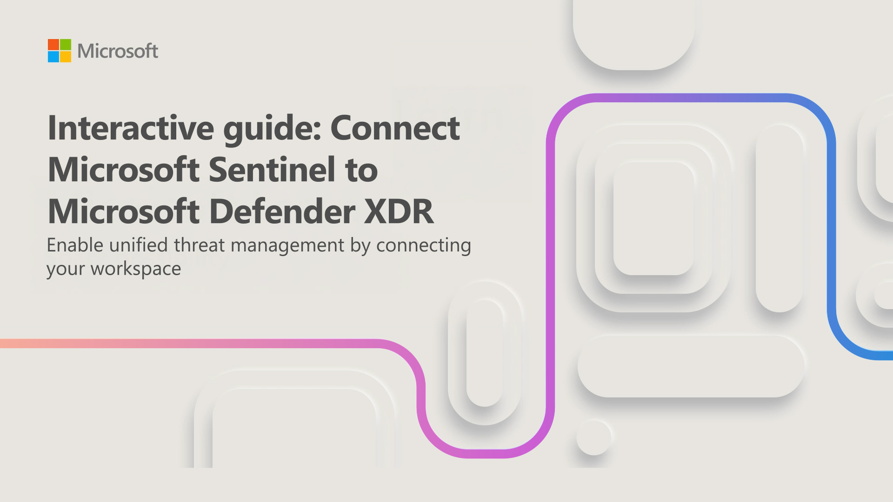

You're a Security Operations Analyst working at a company that deployed both Microsoft Defender XDR and Microsoft Sentinel. You need to prepare for the Unified Security Operations Platform connecting Microsoft Sentinel to Defender XDR. 

In this exercise, you use *Interactive Guides* to simulate performing the following tasks:

- Connect a new Microsoft Sentinel workspace to Microsoft Defender XDR.
- Connect an existing Microsoft Sentinel workspace to Microsoft Defender XDR.
- Explore the Microsoft Sentinel capabilities in the Microsoft Defender XDR portal.

> [!NOTE]
> The environment for this exercise is a simulation generated from the product. As a limited simulation, links on a page may not be enabled and text-based inputs that fall outside of the specified script may not be supported. A pop-up message displays stating, "This feature isn't available within the simulation." When this occurs, select OK and continue the exercise steps.

### Task 1: Connect a new Microsoft Sentinel workspace to Defender XDR

In this interactive guide, which takes approximately 10 minutes to complete, you onboard a new Microsoft Sentinel workspace to Defender XDR.

Select the image below to get started.

### Task 2: Connect an existing Microsoft Sentinel workspace to Defender XDR

In this Interactive Guide, which takes approximately 10 minutes to complete, you connect an existing Microsoft Sentinel workspace to Defender XDR.

Select the image below to get started.

You have completed the simulation exercises to connect Microsoft Sentinel to Microsoft Defender XDR. You can now explore the Microsoft Sentinel capabilities in the Microsoft Defender portal.

> [!NOTE]
> Feel free to explore and compare the other Microsoft Sentinel capabilities, but as this is a simulation, your ability to explore Microsoft Sentinel in the Microsoft Defender portal is limited. In a real environment, you would be able to explore the full Microsoft Sentinel capabilities in the Microsoft Defender portal.
