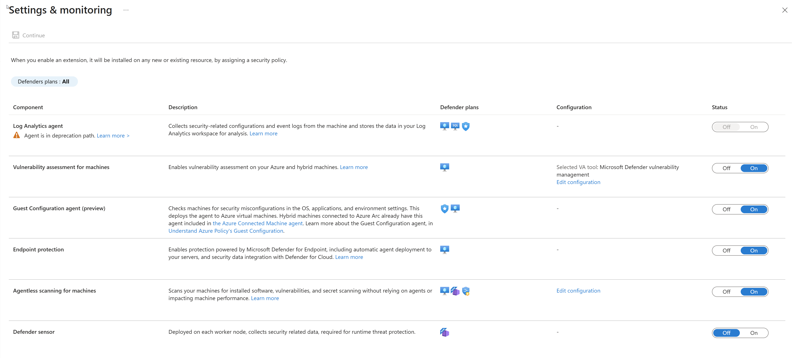

Security Center collects data from your Azure virtual machines (VMs), virtual machine scale sets, IaaS containers, and non-Azure (including on-premises) machines to monitor for security vulnerabilities and threats.

Data collection is required to provide visibility into missing updates, misconfigured OS security settings, endpoint protection status, and health and threat protection. Data collection is only needed for compute resources (VMs, virtual machine scale sets, IaaS containers, and non-Azure computers). You can benefit from Azure Security Center even if you don’t provision agents; however, you will have limited security, and the capabilities listed above are not supported.

Data is collected using:

- The Log Analytics agent, which reads various security-related configurations and event logs from the machine and copies the data to your workspace for analysis. Examples of such data are operating system type and version, operating system logs (Windows event logs), running processes, machine name, IP addresses, and logged in user.

- Security extensions, such as the Azure Policy Add-on for Kubernetes, which can also provide data to Security Center regarding specialized resource types.

>[!div class="mx-imgBorder"]
>

## Why use auto provisioning?

Any of the agents and extensions described on this page can be installed manually. However, auto provisioning reduces management overhead by installing all required agents and extensions on existing - and new - machines to ensure faster security coverage for all supported resources.

## How does auto provisioning work?

Security Center's auto provisioning settings have a toggle for each type of supported extension. When you enable auto provisioning of an extension, you assign the appropriate Deploy if not exists policy to ensure that the extension is provisioned on all existing and future resources of that type.

## Enable auto provisioning of the Log Analytics agent

When automatic provisioning is on for the Log Analytics agent, Security Center deploys the agent on all supported Azure VMs and any new ones created.

To enable auto provisioning of the Log Analytics agent:

1. From Security Center's menu, select **Pricing & settings**.

1. Select the relevant subscription.

1. In the Auto provisioning page, set the agent's status to **On**.

1. From the configuration options pane, define the workspace to use.

>[!div class="mx-imgBorder"]
>

Connect Azure VMs to the default workspace(s) created by Security Center - Security Center creates a new resource group and default workspace in the same geolocation and connects the agent to that workspace. If a subscription contains VMs from multiple geolocations, Security Center creates multiple workspaces to ensure compliance with data privacy requirements.

The naming convention for the workspace and resource group is:

- Workspace: DefaultWorkspace-[subscription-ID]-[geo]
- Resource Group: DefaultResourceGroup-[geo]

Security Center automatically enables a Security Center solution on the workspace per the pricing tier set for the subscription.

Connect Azure VMs to a different workspace - From the dropdown list, select the workspace to store collected data. The dropdown list includes all workspaces across all of your subscriptions. You can use this option to collect data from virtual machines running in different subscriptions and store it all in your selected workspace.

If you already have an existing Log Analytics workspace, you might want to use the same workspace (requires read and write permissions on the workspace). This option is useful if you're using a centralized workspace in your organization and want to use it for security data collection. Learn more in Manage access to log data and workspaces in Azure Monitor.

If your selected workspace already has a Security or Security Center Free solution enabled, the pricing will be set automatically. If not, install a Security Center solution on the workspace:

1. From Security Center's menu, open Pricing & settings.

1. Select the workspace to which you'll be connecting the agents.

1. Select **Azure Defender on** or **Azure Defender off**.

From the Windows security events configuration, select the amount of raw event data to store:

    - None – Disable security event storage. This is the default setting.

    - Minimal – A small set of events for when you want to minimize the event volume.

    - Common – A set of events that satisfies most customers and provides a full audit trail.

    - All events – For customers who want to make sure all events are stored.

Select Apply in the configuration pane.

Select Save. If a workspace needs to be provisioned, agent installation might take up to 25 minutes.

ou'll be asked if you want to reconfigure monitored VMs that were previously connected to a default workspace:

- No - your new workspace settings will only be applied to newly discovered VMs that don't have the Log Analytics agent installed.

- Yes - your new workspace settings will apply to all VMs, and every VM currently connected to a Security Center created workspace will be reconnected to the new target workspace.

## Enable auto provisioning of extensions

To enable automatic provisioning of an extension other than the Log Analytics agent:

1. From Security Center's menu in the Azure portal, select Pricing & settings.

1. Select the relevant subscription.

1. Select Auto provisioning.

1. If you're enabling auto provisioning for the Microsoft Dependency agent, ensure the Log Analytics agent is set to auto deploy too.

1. Toggle the status to On for the relevant extension.

1. Select **Save**. The Azure policy is assigned, and a remediation task is created.

## Windows security event options for the Log Analytics agent

Selecting a data collection tier in Azure Security Center only affects the storage of security events in your Log Analytics workspace. The Log Analytics agent will still collect and analyze the security events required for Security Center’s threat protection, regardless of the level of security events you choose to store in your workspace. Choosing to store security events enables investigation, search, and auditing of those events in your workspace.

Azure Defender is required for storing Windows security event data.  Storing data in Log Analytics might incur more charges for data storage.

### Information for Azure Sentinel users

The security events collection within the context of a single workspace can be configured from either Azure Security Center or Azure Sentinel, but not both. If you're planning to add Azure Sentinel to a workspace that is already getting alerts from Azure Security Center and is set to collect Security Events, you have two options:

- Leave the Security Events collection in Azure Security Center as is. You will be able to query and analyze these events in Azure Sentinel and Azure Defender. However, you will not be able to monitor the connector's connectivity status or change its configuration in Azure Sentinel. If this is important to you, consider the second option.

- Disable Security Events collection in Azure Security Center (by setting Windows security events to None in the configuration of your Log Analytics agent). Then add the Security Events connector in Azure Sentinel. As with the first option, you will be able to query and analyze events in both Azure Sentinel and Azure Defender/ASC, but you will now be able to monitor the connector's connectivity status or change its configuration in - and only in - Azure Sentinel.

### What event types are stored for "Common" and "Minimal"?

These sets were designed to address typical scenarios. Make sure to evaluate which one fits your needs before implementing it.

To determine the events for the Common and Minimal options, we worked with customers and industry standards to learn about the unfiltered frequency of each event and their usage. We used the following guidelines in this process:

- Minimal - Make sure that this set covers only events that might indicate a successful breach and important events that have a low volume. For example, this set contains user successful and failed login (event IDs 4624, 4625), but it doesn’t contain sign out, which is important for auditing but not meaningful for detection and has relatively high volume. Most of the data volume of this set is the login events and process creation event (event ID 4688).

- Common - Provide a full user audit trail in this set. For example, this set contains both user logins and user sign outs (event ID 4634). We include auditing actions like security group changes, key domain controller Kerberos operations, and other events that are recommended by industry organizations.

Events with very low volume were included in the Common set as the main motivation to choose it over all the events is to reduce the volume and not filter out specific events.

Here is a complete breakdown of the Security and App Locker event IDs for each set:

| Data tier| Collected event indicators|
| :--- | :--- |
| Minimal| 1102,4624,4625,4657,4663,4688,4700,4702,4719,4720,4722,4723,4724,4727,4728,4732,4735,4737,4739,4740,4754,4755,

4756,4767,4799,4825,4946,4948,4956,5024,5033,8001,8002,8003,8004,8005,8006,8007,8222|
| Common| 1,299,300,324,340,403,404,410,411,412,413,431,500,501,1100,1102,1107,1108,4608,4610,4611,4614,4622,

4624,4625,4634,4647,4648,4649,4657,4661,4662,4663,4665,4666,4667,4688,4670,4672,4673,4674,4675,4689,4697,

4700,4702,4704,4705,4716,4717,4718,4719,4720,4722,4723,4724,4725,4726,4727,4728,4729,4733,4732,4735,4737,

4738,4739,4740,4742,4744,4745,4746,4750,4751,4752,4754,4755,4756,4757,4760,4761,4762,4764,4767,4768,4771,

4774,4778,4779,4781,4793,4797,4798,4799,4800,4801,4802,4803,4825,4826,4870,4886,4887,4888,4893,4898,4902,

4904,4905,4907,4931,4932,4933,4946,4948,4956,4985,5024,5033,5059,5136,5137,5140,5145,5632,6144,6145,6272,

6273,6278,6416,6423,6424,8001,8002,8003,8004,8005,8006,8007,8222,26401,30004|

### Setting the security event option at the workspace level

You can define the level of security event data to store at the workspace level.

- From Security Center's menu in the Azure portal, select Pricing & settings.

- Select the relevant workspace. The only data collection events for a workspace are the Windows security events described on this page.

>[!div class="mx-imgBorder"]
>

- Select the amount of raw event data to store and select Save.

