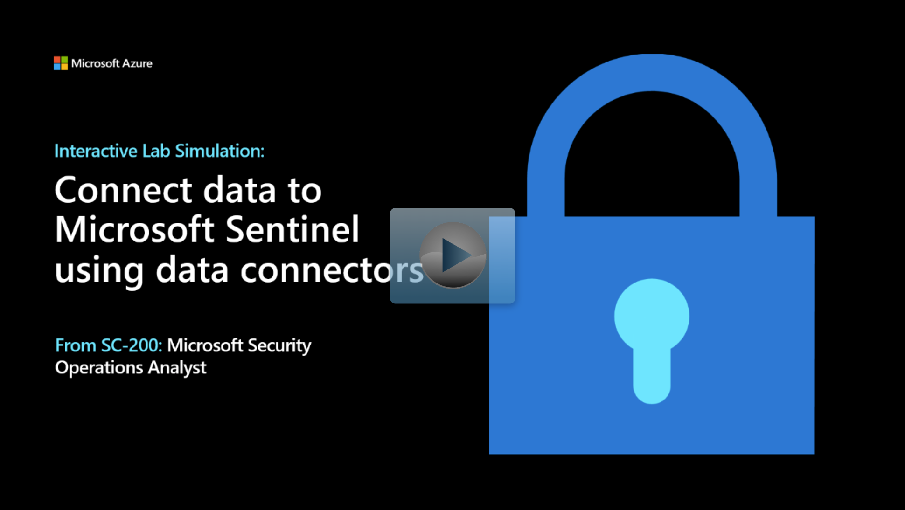

Data is sent to the Microsoft Sentinel workspace by configuring the provided data connectors. The data connectors are included in out-of-the-box (OOTB), or built-in Content Hub solutions for Microsoft 365 services, Azure, and third-party specific.
  
You're a Security Operations Analyst working at a company that implemented Microsoft Sentinel. You need to learn how to connect log data from the many different data sources in your organization. The organization has data from Microsoft 365, Microsoft 365 Defender, Azure resources, non-azure virtual machines, and network appliances.

You plan on using the Microsoft Sentinel Content Hub solutions that include the data connectors to integrate the log data from the various sources. You need to document a connector plan for management that maps each of the organization's data sources to the proper Microsoft Sentinel data connector.

After completing this module, you'll be able to:

- Describe how to install Content Hub Solutions to provision Microsoft Sentinel Data connectors
- Explain the use of data connectors in Microsoft Sentinel
- Describe the Microsoft Sentinel data connector providers
- Explain the Common Event Format and Syslog connector differences in Microsoft Sentinel

## Prerequisites

Basic experience with Microsoft Azure operations.

## Interactive lab simulation

> [!NOTE]
> Select the thumbnail image to start the lab simulation. You may find slight differences between this interactive simulation and this modules content, but the core concepts and ideas being demonstrated are the same. When you're done, be sure to return to this page so you can continue learning.

