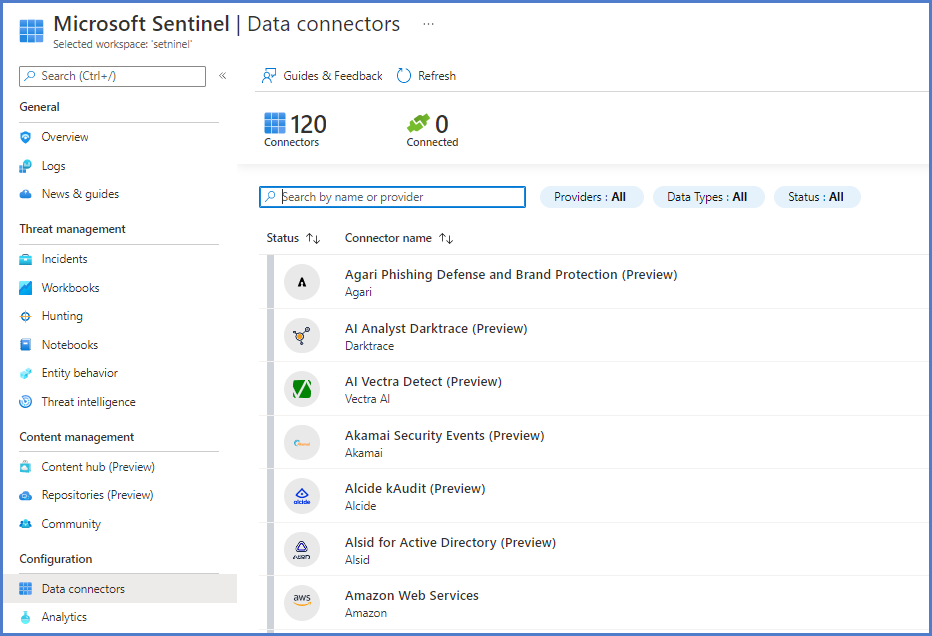
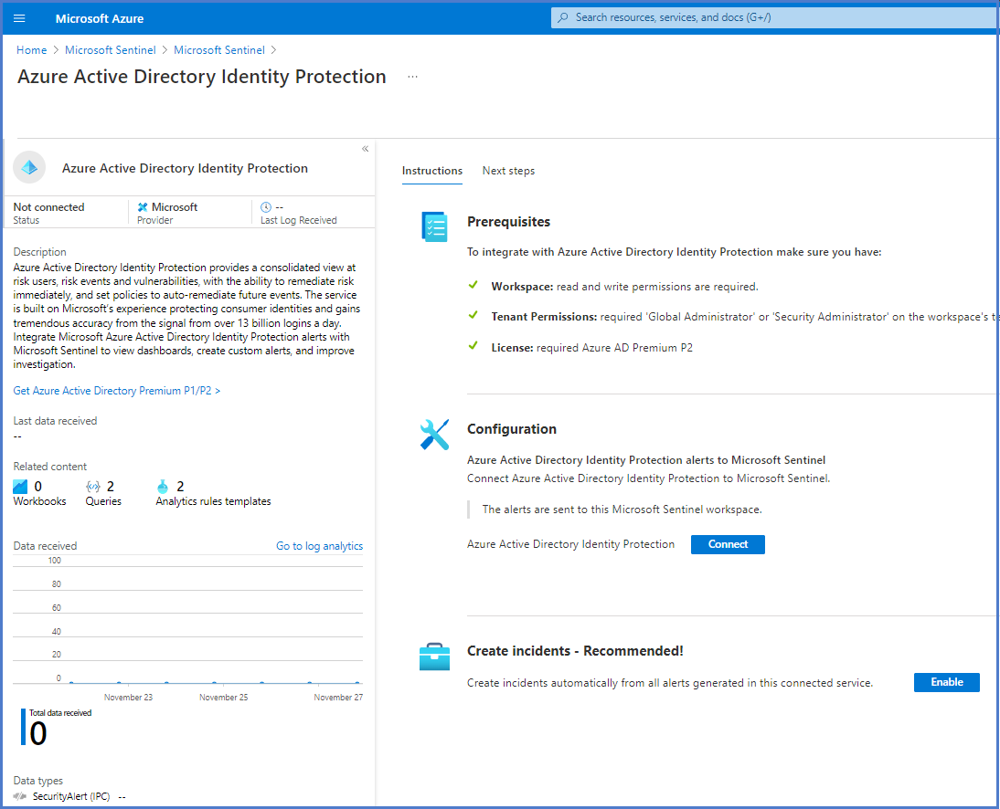

To collect log data, you need to connect your data sources with Azure Sentinel Connectors. The Data Connectors page displays a growing list of connectors provided by Azure Sentinel.

>[!div class="mx-imgBorder"]
>

After selecting the Open connector page, the detailed connector page has a left blade and a right blade.

>[!div class="mx-imgBorder"]
>

The left blade provides information about the connector, the connector's status, and the last time a log was received if connected.  On the bottom section of the left blade is the Data Types.  The Data Types will list the table(s) that the connector will write to.

The right tab has two tabs: Instructions and Next steps.  The Instructions tab can be different based on the connector.  In general, there will be Prerequisites and Configuration.  Follow the Configuration to connect to the data source.  The Next steps tab provides a quick reference to workbooks, query samples, and analytical templates.  Data Connectors can only be disconnected/deactivated, not deleted.

> [!NOTE]
> The connector does not install Workbooks and Analytics Templates.  Workbooks and Analytic Templates for out of the box connectors are already available in the Sentinel environment. 

