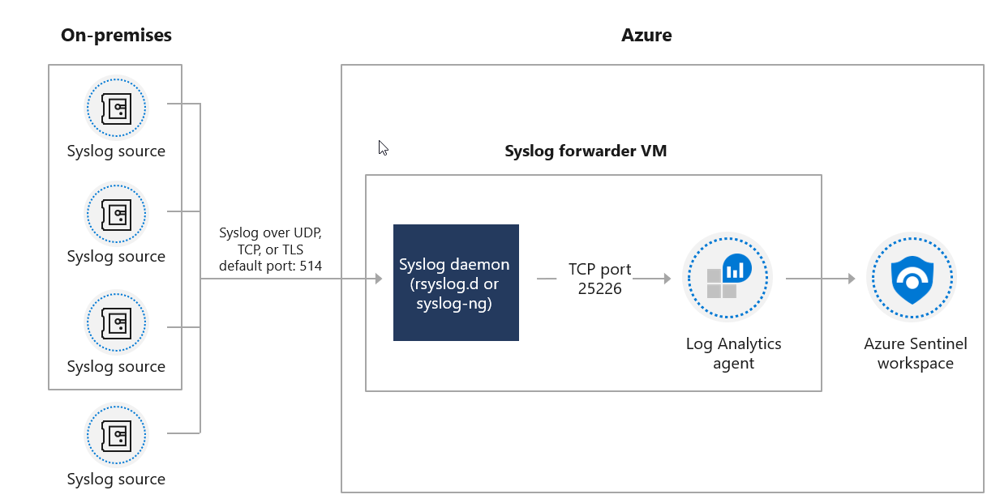
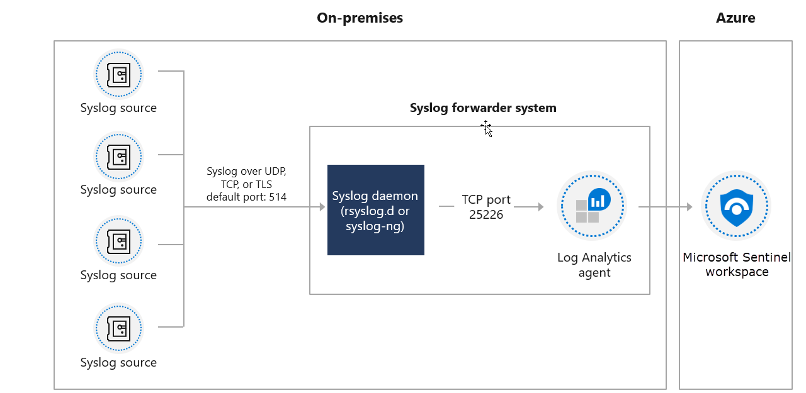

### Microsoft 365 Defender

The Microsoft 365 Defender and related data connectors provide alerts and data that has already been normalized and used in the Microsoft 365 Defender portal.

The Microsoft 365 Defender products include:

- Microsoft Defender for Endpoint

- Microsoft Defender for Identity

- Microsoft Defender for Office 365

- Microsoft Cloud App Security

### Microsoft/Azure Services

The connectors for Microsoft and Azure-related services include (but are not limited to):

- Azure Active Directory - audit logs and sign-in logs

- Azure Activity

- Azure AD Identity Protection

- Azure DDoS Protection

- Azure Defender for IoT (formerly Azure Security Center for IoT)

- Azure Information Protection

- Azure Firewall

- Azure Security Center - alerts from Azure Defender solutions

- Azure Web Application Firewall (WAF) (formerly Microsoft WAF)

- Cloud App Security

- Domain name server

- Office 365

- Windows firewall

- Security Events

### Vendor connectors

Azure Sentinel provides an ever-growing list of vendor-specific data connectors.  These connectors primarily use the CEF and Syslog connector.

> [!TIP]
> Remember to check the connector page to see the Data Type (table) that the connector writes to

### Custom connectors using the Log Analytics API

You can use the Log Analytics Data Collector API to send log data to the Azure Sentinel Log Analytics workspace.

### Logstash plugin

Using Azure Sentinel's output plugin for the Logstash data collection engine, you can send any log you want through Logstash directly to your Log Analytics workspace in Azure Sentinel. The logs are written to a custom table that you define using the output plugin.

## CEF and Syslog connector

If there is no vendor-provided connector, you can use the generic Common Event Format(CEF) or Syslog Connector.

Syslog is an event logging protocol that is common to Linux. Applications will send messages that may be stored on the local machine or delivered to a Syslog collector.

Common Event Format (CEF) is an industry-standard format on top of Syslog messages, used by many security vendors to allow event interoperability among different platforms. 

### Syslog vs. Common Event Format

CEF is always a superior choice because the log data is parsed into predefined fields in the CommonSecurityLog table.  Syslog provides header fields, but the raw log message is stored in a field named SyslogMessage in the Syslog table.  For the Syslog data to be queried, you will need to write a parser to extract the specific fields.   The process to create a Parser for a Syslog message will be demonstrated in a later module.

### Connector architecture options

To connect the CEF or Syslog Collector to Azure Sentinel, the agent must deploy on a dedicated Azure virtual machine (VM) or an on-premises system to support the appliance's communication with Azure Sentinel. You can deploy the agent automatically or manually. Automatic deployment is only available if your dedicated machine is a Virtual Machine in Azure.

The following diagram illustrates on-premises systems sending Syslog data to a dedicated Azure VM running the Azure Sentinel agent.

Alternatively, you can manually deploy the agent on an existing Azure VM, on a VM in another cloud, or an on-premises machine. The following diagram illustrates on-premises systems sending Syslog data to a dedicated on-premises system running the Azure Sentinel agent.

