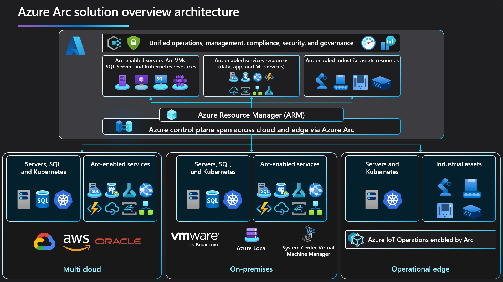

Today, companies struggle to control and govern increasingly complex environments. These environments extend across data centers, multiple clouds, and edge. Each environment and cloud possesses its own set of disjointed management tools that you need to learn and operate.

In parallel, new DevOps and ITOps operational models are hard to implement, as existing tools fail to provide support for new cloud native patterns.

Azure Arc simplifies governance and management by delivering a consistent multi-cloud and on-premises management platform. Azure Arc enables you to:

- Manage your entire environment, with a single pane of glass, by projecting your existing non-Azure, on-premises, or other-cloud resources into Azure Resource Manager.
- Manage virtual machines, Kubernetes clusters, and databases as if they are running in Azure.
- Use familiar Azure services and management capabilities, regardless of where they live.
- Continue using traditional ITOps, while introducing DevOps practices to support new cloud native patterns in your environment.
- Configure Custom Locations as an abstraction layer on top of Azure Arc-enabled Kubernetes cluster, cluster connect, and cluster extensions.

>[!div class="mx-imgBorder"]
>

Today, Azure Arc allows you to manage the following resource types hosted outside of Azure:

Servers - both physical and virtual machines running Windows or Linux.
Kubernetes clusters - supporting multiple Kubernetes distributions.
Azure data services - Azure SQL Managed Instance and PostgreSQL Hyperscale services.
SQL Server - enroll instances from any location with SQL Server on Azure Arc-enabled servers.