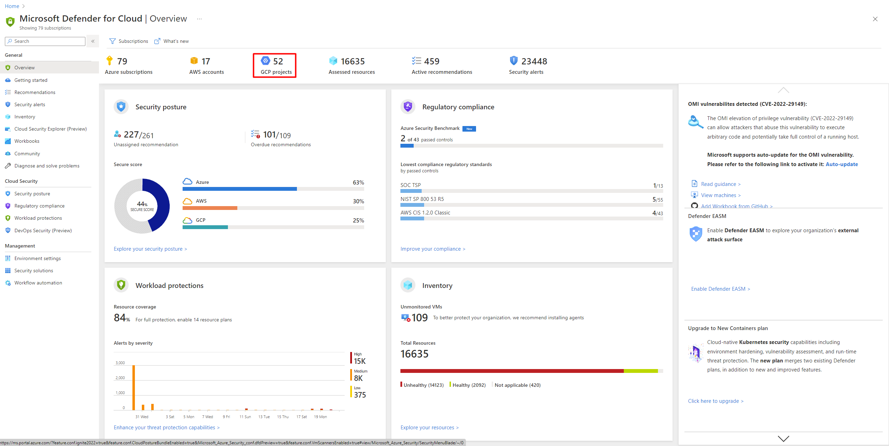

Onboarding your GCP account into Security Center, integrates GCP Security Command and Azure Security Center. Security Center thus provides visibility and protection across both of these cloud environments to provide:

- Detection of security misconfigurations

- A single view showing Security Center recommendations and GCP Security Command Center findings

- Incorporation of your GCP resources into Security Center's secure score calculations

- Integration of GCP Security Command Center recommendations based on the CIS standard into the Security Center's regulatory compliance dashboard

In the screenshot below, you can see GCP projects displayed in Security Center's overview dashboard.

### Follow the steps below to create your GCP cloud connector.

**Set up GCP Security Command Center with Security Health Analytics**

For all the GCP projects in your organization, you must also:

- Set up GCP Security Command Center using these instructions from the GCP documentation.

- Enable Security Health Analytics using these instructions from the GCP documentation.

- Verify that there is data flowing to the Security Command Center.

The instructions for connecting your GCP environment for security configuration follow Google's recommendations for consuming security configuration recommendations. The integration uses Google Security Command Center and will consume more resources that might impact your billing.

When you first enable Security Health Analytics, it might take several hours for data to be available.

**Enable GCP Security Command Center API**

From Google's Cloud Console API Library, select the project you want to connect to Azure Security Center.

In the API Library, find and select Security Command Center API.

On the API's page, select ENABLE.

**Create a dedicated service account for the security configuration integration**

In the GCP Console, select the project you want to connect to Security Center.

In the Navigation menu, Under IAM & admin options, select Service accounts.

- Select CREATE SERVICE ACCOUNT.

- Enter an account name, and select Create.

- Specify the Role as Security Center Admin Viewer, and select Continue.

- The Grant users access to this service account section is optional. Select Done.

- Copy the Email value of the created service account, and save it for later use.

- In the Navigation menu, Under IAM & admin options, select IAM

  - Switch to organization level.

  - Select ADD.

  - In the New members field, paste the Email value you copied earlier.

  - Specify the Role as Security Center Admin Viewer and then select Save.

**Create a private key for the dedicated service account**

Switch to project level.

In the Navigation menu, Under IAM & admin options, select Service accounts.

- Open the dedicated service account and select Edit.

- In the Keys section, select ADD KEY and then Create new key.

- In the Create private key screen, select JSON, and then select CREATE.

- Save this JSON file for later use.

**Connect GCP to Security Center**

From Security Center's menu, select Cloud connectors.

Select add GCP account.

On the onboarding page, do the following and then select Next.

- Validate the chosen subscription.

- In the Display name field, enter a display name for the connector.

- In the Organization ID field, enter your organization's ID.

- In the Private key file box, browse to the JSON file you downloaded in Step 4. Create a private key for the dedicated service account.

**Confirmation**

When the connector is successfully created and GCP Security Command Center has been configured properly:

- The GCP CIS standard will be shown in the Security Center's regulatory compliance dashboard.

- Security recommendations for your GCP resources will appear in the Security Center portal and the regulatory compliance dashboard 5-10 minutes after onboard completes:

