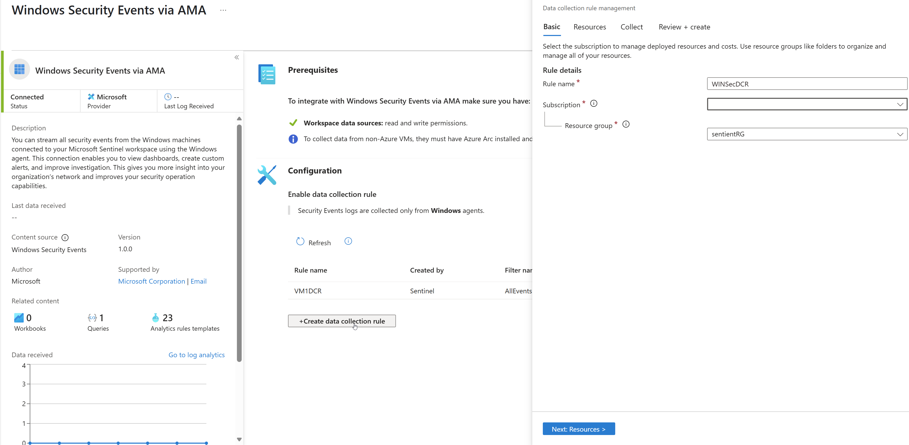
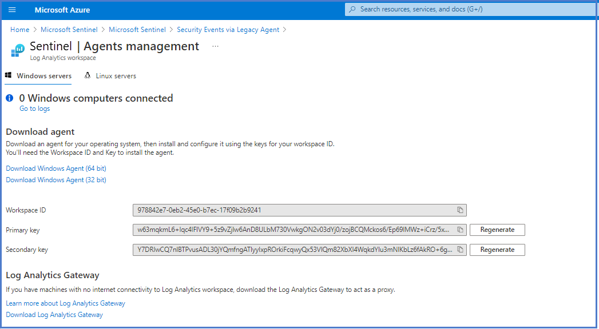

The Security Events connector lets you stream all security events from your Windows systems (servers and workstations, physical and virtual) to your Azure Sentinel workspace. This enables you to view Windows security events in your dashboards, use them to create custom alerts, and rely on them to improve your investigations, giving you more insight into your organization's network and expanding your security operations capabilities. You can select which events to stream from among the following sets:

- All events - All Windows security and AppLocker events.

- Common - A standard set of events for auditing purposes. A full user audit trail is included in this set. For example, it contains both user sign-in and user sign out events (event IDs 4624, 4634). There are also auditing actions such as security group changes, key domain controller Kerberos operations, and other types of events in line with accepted best practices.

- The Common event set may contain some types of events that aren't so common. This is because the main point of the Common set is to reduce the volume of events to a more manageable level while still maintaining full audit trail capability.

- Minimal - A small set of events that might indicate potential threats. This set does not contain a full audit trail. It covers only events that might indicate a successful breach and other significant events with low rates of occurrence. For example, it contains successful and failed user logons (event IDs 4624, 4625). Still, it doesn't contain sign-out information (4634), which, while important for auditing, is not meaningful for breach detection and has a relatively high volume. Most of this set's data volume comprises sign-in events and process creation events (event ID 4688).

- None - No security or AppLocker events. (This setting is used to disable the connector.)

The following list provides a complete breakdown of the Security and App Locker event IDs for each set:

| Event set| Collected event IDs|
| :--- | :--- |
| Minimal| 1102, 4624, 4625, 4657, 4663, 4688, 4700, 4702, 4719, 4720, 4722, 4723, 4724, 4727, 4728, 4732, 4735, 4737, 4739, 4740, 4754, 4755, 4756, 4767, 4799, 4825, 4946, 4948, 4956, 5024, 5033, 8001, 8002, 8003, 8004, 8005, 8006, 8007, 8222|
| Common| 1, 299, 300, 324, 340, 403, 404, 410, 411, 412, 413, 431, 500, 501, 1100, 1102, 1107, 1108, 4608, 4610, 4611, 4614, 4622, 4624, 4625, 4634, 4647, 4648, 4649, 4657, 4661, 4662, 4663, 4665, 4666, 4667, 4688, 4670, 4672, 4673, 4674, 4675, 4689, 4697, 4700, 4702, 4704, 4705, 4716, 4717, 4718, 4719, 4720, 4722, 4723, 4724, 4725, 4726, 4727, 4728, 4729, 4733, 4732, 4735, 4737, 4738, 4739, 4740, 4742, 4744, 4745, 4746, 4750, 4751, 4752, 4754, 4755, 4756, 4757, 4760, 4761, 4762, 4764, 4767, 4768, 4771, 4774, 4778, 4779, 4781, 4793, 4797, 4798, 4799, 4800, 4801, 4802, 4803, 4825, 4826, 4870, 4886, 4887, 4888, 4893, 4898, 4902, 4904, 4905, 4907, 4931, 4932, 4933, 4946, 4948, 4956, 4985, 5024, 5033, 5059, 5136, 5137, 5140, 5145, 5632, 6144, 6145, 6272, 6273, 6278, 6416, 6423, 6424, 8001, 8002, 8003, 8004, 8005, 8006, 8007, 8222, 26401, 30004|

## Connect Azure Windows Virtual Machines

To view the connector page:

1. Select **Data connectors page**.

1. Select **Security Events**.

1. Then select the **Open connector** page on the preview pane.

1. Verify that you have the appropriate permissions as described under Prerequisites.

1. Select **Install agent on Azure Windows Virtual Machine**, and then on the link that appears below.

1. For each virtual machine that you want to connect, select its name in the list that appears on the right, and then select **Connect**.

1. Select which event set ([All, Common, or Minimal](https://docs.microsoft.com/azure/sentinel/connect-windows-security-events?azure-portal=true)) you want to stream.

1. Select **Update**.

## Connect non-Azure Windows Machines

To view the connector page:

1. Select **Data connectors** page.

1. Select **Security Events**.

1. Then select the **Open connector** page on the preview pane.

1. Verify that you have the appropriate permissions as described under Prerequisites.

1. Select **Install agent on non-Azure Windows Machine**, and then on the link that appears below.

1. Select the appropriate download links that appear on the right, under Windows Computers.

1. Using the downloaded executable file, install the agent on the Windows systems of your choice, and configure it using the Workspace ID and Keys that appear below the download links mentioned above.

1. Select which event set (All, Common, or Minimal) you want to stream.

1. Select **Update**.

