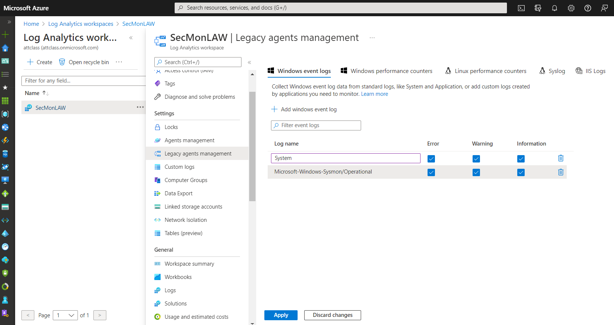

System Monitor (Sysmon) is a Windows system service, and device driver that remains resident across system reboots to monitor and log system activity to the Windows event log once installed on a system. It provides detailed information about process creations, network connections, and changes to file creation time. By collecting the events it generates using Windows Event Collection or SIEM agents and then analyzing them, you can identify malicious or anomalous activity and understand how intruders and malware operate on your network.

Installing and configuring Sysmon is out of the scope of this module.  Because Sysmon is a telemetry tool that many organizations use, it is essential to know how to configure the Log Analytics Agent and Workspace to collect the Sysmon events.

After connecting the agent to the windows machine:

- Select the Settings page.

- Select Workspace Settings.

- In the Log Analytics Workspace Settings area, select Advanced Settings

- Select Data.

- Make sure Windows Event Logs is selected

- In the "Collect events from the following log events" textbox, enter: Microsoft-Windows-Sysmon/Operation

- Then press the +

Once configured, the Sysmon events will be available in the Event table.

