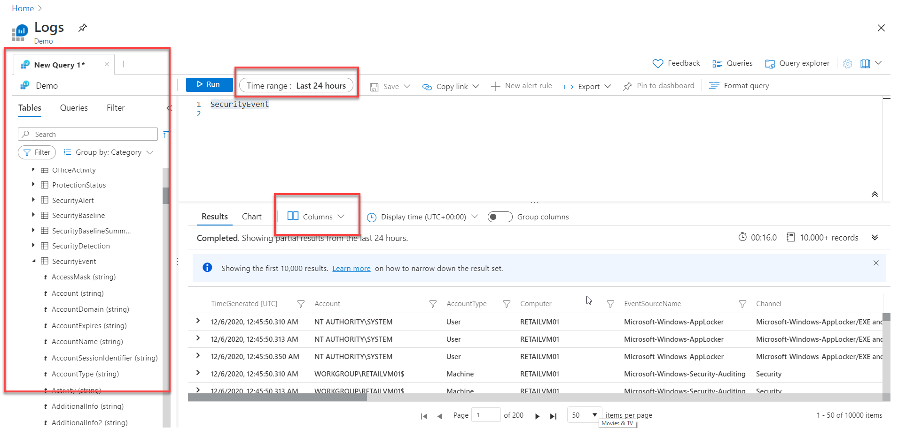

A KQL query is a read-only request to process data and return results. The request is stated in plain text, using a data-flow model designed to make the syntax easy to read, write, and automate. The query uses schema entities organized in a hierarchy similar to SQL's: databases, tables, and columns.

The query consists of a sequence of query statements. At least one statement is a tabular expression statement that produces data arranged in a table-like mesh of columns and rows. The query's tabular expression statements produce the results of the query.

The tabular expression statement's syntax has tabular data flow from one tabular query operator to another, starting with the data source and then flowing through a set of data transformation operators bound together by using the pipe (|) delimiter.

For example, the following query has a single statement, which is a tabular expression statement. The statement starts with a table called SecurityEvent. The EventID column's value filters the data (rows) and then the results are summarized by creating a new column for the count() by Account.  Next, in the Prepare phase, the results are then limited to 10 rows.

> [!IMPORTANT]
> It is essential to understand how the results flow through the pipe "|".  Everything on the left of the pipe is processed then passed to the right of the pipe.  

## Access the Log Analytics demo environment

Microsoft provides access to an environment to practice writing KQL statements.  The only requirement is to have an account to log into Azure.  There are no charges to your Azure account to access this environment.  You can execute the KQL statements in this module in the demo environment.

You can access the demo environment at [https://aka.ms/lademo](https://aka.ms/lademo?azure-portal=true)

> [!IMPORTANT]
> The log analytics demo database is a dynamic environment.  The events recorded in the tables in that environment are continuously updating with different security events. This is similar to what a person would experience in a real-world security operations setting.  As a result, finite queries in this training may show no results depending on the state of the demo database at the time the query is run.  For example, a query on the *SecurityEvent* table for "discardEventID = 4688" within the last day may show no results if that particular event last took place three days ago.  Therefore, you may need to adjust variables in the scripts listed in this training ad hoc depending on what data is in the demo database at the time you run the script in order for the query to show results.  These script adjustments are similar to what you would perform in the real world and should help you learn how the specific parts of the script function.  

The Query window has three primary sections:

- The left area is a reference list of the tables in the environment.

- The middle top area is the Query editor.

- The bottom area is the Query Results.

Before running a query, adjust the time range to scope the data.  To change the result columns displayed, select the Columns box, and choose the required columns.

