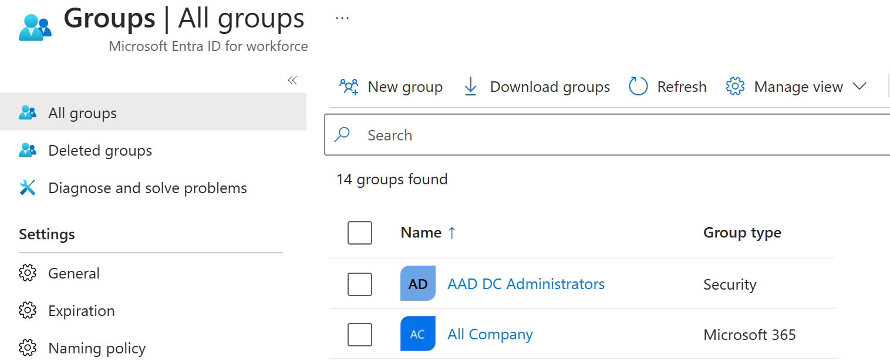

An Azure Active Directory (Azure AD) group helps organize users, which makes it easier to manage permissions. Using groups lets the resource owner (or Azure AD directory owner), assign a set of access permissions to all the members of the group, instead of having to provide the rights one-by-one. Groups allow us to define a security boundary and then add and remove specific users to grant or deny access with a minimum amount of effort. Even better, Azure AD supports the ability to define membership based on rules - such as what department a user works in, or the job title they have.

Azure AD allows you to define two different types of groups.

- **Security groups**. These are the most common and are used to manage member and computer access to shared resources for a group of users. For example, you can create a security group for a specific security policy. By doing it this way, you can give a set of permissions to all the members at once, instead of having to add permissions to each member individually. This option requires an Azure AD administrator.

- **Microsoft 365 groups**. These groups provide collaboration opportunities by giving members access to a shared mailbox, calendar, files, SharePoint site, and more. This option also lets you give people outside of your organization access to the group. This option is available to users as well as admins.

## View available groups

You can view all groups through the **Groups** item under the **Manage** group from the Azure AD dashboard. A new Azure AD install won't have any groups defined.

> [!div class="mx-imgBorder"]
> 

