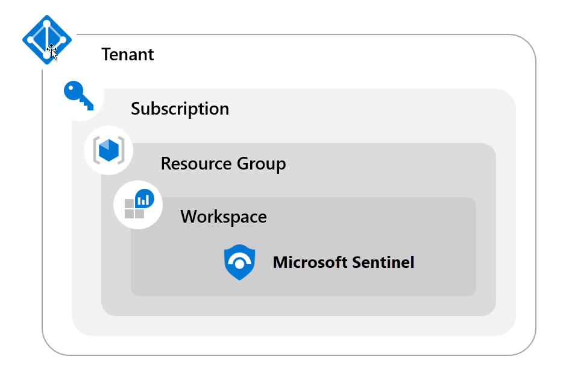
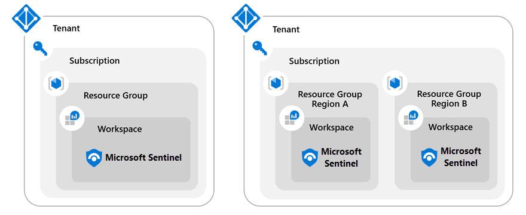
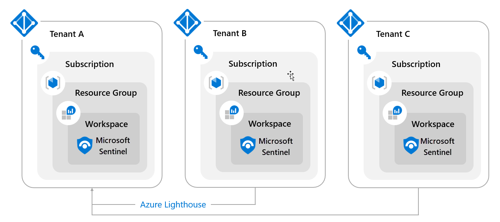

Before deploying Azure Sentinel, it is crucial to understand the workspace options.  The Azure Sentinel solution is installed in a Log Analytics Workspace, and most implementation considerations are focused on the Log Analytics Workspace creation.  The single most important option when creating a new Log Analytics Workspace is the region.  The region specifies the location where the log data will reside.

The three implementation options:

- Single-Tenant with a single Azure Sentinel Workspace

- Single-Tenant with regional Azure Sentinel Workspaces

- Multi-Tenant

## Single-tenant single workspace

The single-tenant with a single Azure Sentinel workspace will be the central repository for logs across all resources within the same tenant.

This workspace receives logs from resources in other regions within the same tenant.  Because the log data (when collected) will travel across regions and stored in another region, this creates two possible concerns.  First, it can incur a bandwidth cost. Second, if there is a data governance requirement to keep data in a specific region, the single workspace option would not be an implementation option.



Single-Tenant with a single workspace pros and cons include:

| Pros| Cons|
| :--- | :--- |
| Central Pane of Glass| May not meet Data Governance Requirements|
| Consolidates all security logs and information| Can incur bandwidth cost for cross region|
| Easier to query all information||
| Azure Log Analytics RBAC to control data access||
| Azure Sentinel RBAC for service RBAC||

## Single-tenant with regional Azure Sentinel workspaces

The single-tenant with regional Azure Sentinel workspaces will have multiple Sentinel workspaces requiring the creation and configuration of multiple Azure Sentinel and Log Analytics workspaces.



| Pros| Cons|
| :--- | :--- |
| No cross-region bandwidth costs| No central pane of glass. You are not looking in one place to see all the data.|
| May be required to meet Data Governance requirements| Analytics, Workbooks, etc. must be deployed multiple times.|
| Granular data access control||
| Granular retention settings||
| Split billing||

To query data across workspaces, use the workspace() function before the table name.

```kusto
TableName

| union workspace(“WorkspaceName").TableName

```

## Multi-tenant workspaces

If you are required to manage an Azure Sentinel workspace, not in your tenant, you implement Multi-Tenant workspaces using Azure Lighthouse.  This security configuration grants you access to the tenants.  The tenant configuration within the tenant (regional or multi-regional) is the same consideration as before.



