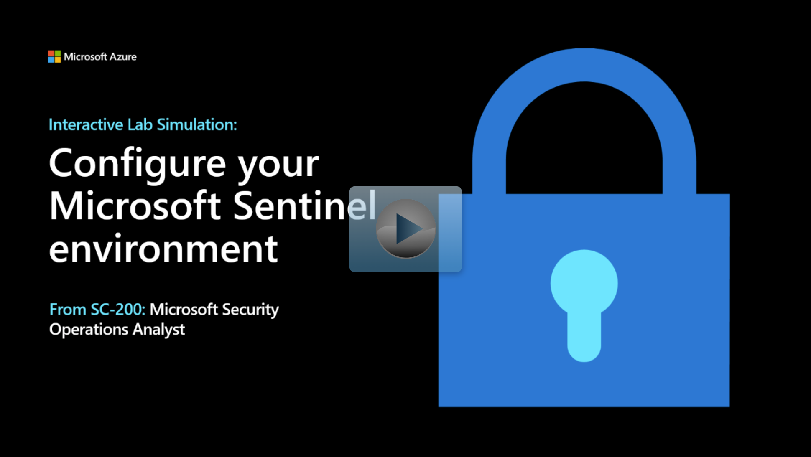

After designing the workspace architecture, log in to the Azure portal. At the search bar, search for Sentinel, then select **Microsoft Sentinel**.  The Microsoft Sentinel Workspaces shows a list of the current workspaces.  Select the **+ add** button to start the creation process.

> [!NOTE]
> If you choose to perform this exercise, be aware you might incur costs in your Azure Subscription. To estimate the cost, refer to [Microsoft Sentinel Pricing](https://azure.microsoft.com/pricing/details/azure-sentinel/). We have also included an interactive lab simulation after the exercise.

## Microsoft Sentinel installation prerequisites

To enable Microsoft Sentinel, you need contributor permissions to the subscription in which the Microsoft Sentinel workspace resides. To use Microsoft Sentinel, you need either contributor or reader permissions on the resource group that the workspace belongs.

## Create and configure a Log Analytics Workspace

1. The next page, **Add Microsoft Sentinel to a workspace** will display a list of available Log Analytics workspaces to add Microsoft Sentinel.  Select the **+ create a new workspace** button to start the "Create Log Analytics workspace" process.

1. The Basics tab includes the following options:

    | Option| Description|
    | :--- | :--- |
    | Subscription| Select the Subscription|
    | Resource Group| Select or create a Resource Group|
    | Name| Name is the name of the Log Analytics workspace and will also be the name of your Microsoft Sentinel Workspace|
    | Region| The region is the location the log data is stored.|

    > [!IMPORTANT]
    > The Name will be the name of the Microsoft Sentinel workspace.  The Microsoft Sentinel name will default to the Log Analytics Workspace Name.
    > The Region is the location where ingested data is stored.  The data location impacts data governance requirements.  Workspaces can't move from region to region; you will need to recreate the workspace if the region option needs to be changed.

1. Select the **Review + Create** button and then select the **Create** button.

## Add Microsoft Sentinel to the workspace

The "Add Microsoft Sentinel to Workspace" screen will now appear after you've completed the previous steps.

 1. Wait for the newly created "Log Analytics Workspace" to appear in the list.  This operation could take a few minutes.

 1. Select the newly created Log Analytics workspace. And select the **Add** button.

The new Microsoft Sentinel workspace is now the active screen.  The Microsoft Sentinel left navigation has four areas:  

- General
- Threat management
- Content management
- Configuration

The Overview tab displays a standard dashboard of information about the ingested data, alerts, and incidents.

## Interactive Lab Simulation

> [!NOTE]
> Select the thumbnail image to start the lab simulation. When you're done, be sure to return to this page so you can continue learning.

## Microsoft Sentinel sharing a Log Analytics Workspace

Considering that Microsoft Sentinel workspace uses a Log Analytics workspace, you have the option to enable the Sentinel workspace in a Log Analytics workspace that is used by other solutions. The most common scenario is sharing the Log Analytics workspace used by Microsoft Defender for Cloud.  Sharing the workspace enables one central workspace to query security data.  

## Microsoft Defender for Cloud
When creating your Microsoft Sentinel workspace, you aren't allowed to use the **Default** Microsoft Defender for Cloud Log Analytics workspace.  You need to manually create a Log Analytics workspace then update the Microsoft Defender for Cloud tier.  Now you can select the manually created Log Analytics workspace for use with Microsoft Defender for Cloud.
