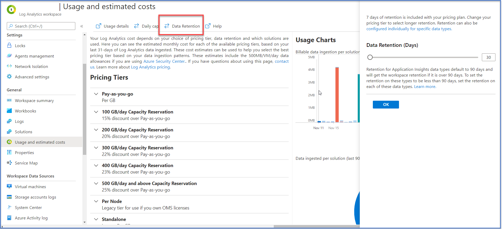

Azure Sentinel Environment Settings are managed in two areas.  In Azure Sentinel and in the Log Analytics workspace where Azure Sentinel resides. In Azure Sentinel, the left navigation has an option for Settings.  The Settings includes tabs for Pricing, Settings, and Workspace Settings—the Settings changes over time based on the current and in-preview feature set.  Most Azure Sentinel Environment settings are managed in the Log Analytics workspace.  Other areas within the Azure Sentinel portal will transfer you to the Log Analytics portal.  One example of this is are specific data connector configurations will be performed in the log analytics workspace.

## Configure log retention

By default, log retention is set for 30 days.  To adjust the retention days, select the workplace settings in the Azure Sentinel Settings area.  The next screen is in the Log Analytics portal.  Select the "Usage and estimated costs" tab.  At the top of the page, select the "Retention" button.  A blade will open, allowing for the adjustment of the retention days.

