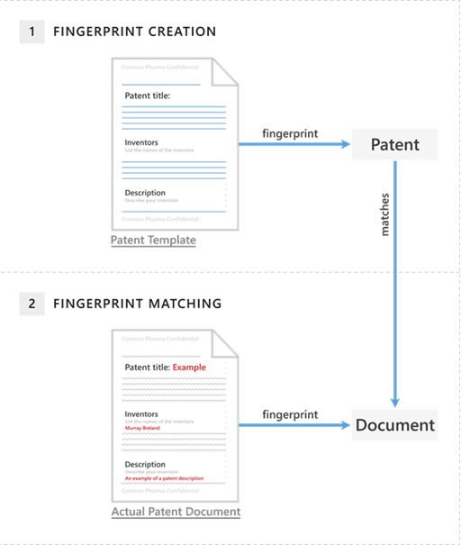

Information workers in your organization handle many kinds of sensitive information during a typical day. Document Fingerprinting in Microsoft 365 makes it easier for you to protect this information by identifying standard forms that are used throughout your organization. 

Configuring a document fingerprint as a custom sensitive information type allows you to prevent unintended sharing of documents created from official company templates. For example, human resources documents, possibly containing personal information, or patent documents containing intellectual property may be identified by document fingerprinting even if the content doesn't meet other sensitive information type criteria.

You've probably already guessed that documents don't have actual fingerprints, but the name helps explain the feature. In the same way that a person's fingerprints have unique patterns, documents have unique word patterns. When you upload a file, DLP identifies the unique word pattern in the document, creates a document fingerprint based on that pattern, and uses that document fingerprint to detect outbound documents containing the same pattern. 

That's why uploading a form or template creates the most effective type of document fingerprint. Everyone who fills out a form uses the same original set of words and then adds their own words to the document. If the outbound document isn't password protected and contains all the text from the original form, DLP can determine if the document matches the document fingerprint.

> [!NOTE]
> Document fingerprint only works with Exchange Online.

The following picture shows the basic functionality how document fingerprint functions.

In this example, the patent template document contains the blank fields "Patent title," "Inventors," and "Description" and descriptions for each of those fields, which is the word pattern. When the word pattern is converted into a document fingerprint, a small Unicode XML file with a unique hash value is generated, which represents the original text. 

The fingerprint is also saved as a data classification in Active Directory, as a security measure, because the original document itself isn't stored on the service, but only the hash value is stored, and the original document can't be reconstructed from the hash value. The patent fingerprint then becomes a sensitive information type that can be associated with a policy and any outbound emails containing documents created from the template that match the patent fingerprint, are detected.

Document Fingerprinting supports the same file types that are supported in mail flow rules, for which an overview can be found in the resources at the end of this module. Document fingerprinting won't detect sensitive information in the following cases:

- Password protected files.

- Documents that only contain images.

- Documents that don't contain all the text from the original form used to create the document fingerprint.

> [!NOTE]
> Neither mail flow rules nor Document Fingerprinting supports the .dotx file type, even if this is a common file type for Word documents.

