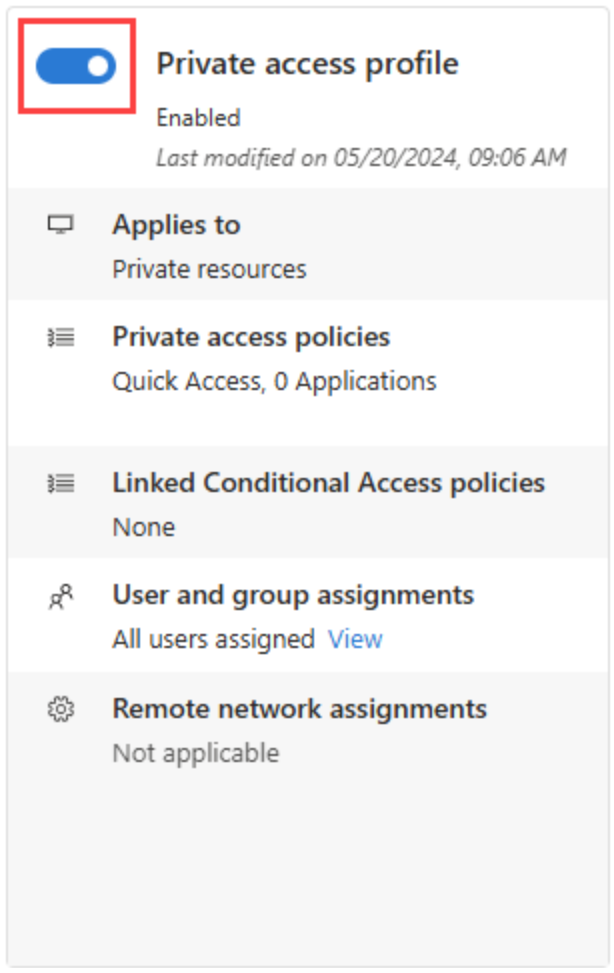

Similar to configuring Microsoft Entra Internet Access, there are four main steps for getting Microsoft Entra Private Access deployed within your company. After you complete these four steps, users with the Global Secure Access client installed on a Windows device can connect to your primary resources, through a Quick Access app, and private network connector.

Steps:
| Steps | Description |
| :--- | :--- |
| 1. Configure a Microsoft Entra private network connector and connector group.| tbd |
| 2. Configure Quick Access to your private resources. | tbd |
| 3. Enable the Private Access traffic forwarding profile. | tbd |
| 4. Install and configure the Global Secure Access Client on end-user devices. | Use Conditional Access and Global Secure Access to prevent attacks. |
| | |

## Configure a Microsoft Entra private network connector and connect groups
Connectors are lightweight agents that sit on a server in a private network and facilitate the outbound connection to the Global Secure Access service. Connectors must be installed on a Windows Server that has access to the backend resources and applications. You can organize connectors into connector groups, with each group handling traffic to specific applications.

**Configuring the Windows Server for connectors**

The Microsoft Entra private network connector requires a server running Windows Server 2012 R2 or later. You install the private network connector on the server. This connector server needs to connect to the Microsoft Entra Private Access service or application proxy service and the private resources or applications that you plan to publish.
- For high availability in your environment, we recommend having more than one Windows server.
- The minimum .NET version required for the connector is v4.7.1+.
- Requires Transport Layer Security (TLS) 1.2 be enabled on Windows Server.

Open ports for **outbound**:
| Port number | What the port is used for |
| :--- | :--- |
| 80 | Downloading certificate revocation lists (CRLs) while validating the TLS/SSL certificate |
| 443 | All outbound communication with the Application Proxy service |
| | |

Allow access to some URLs:
| URL | Port | What the port is used for |
| :--- | :--- | :--- |
| *.msappproxy.net *.servicebus.windows.net | 443/HTTPS | Communication between the connector and the Application Proxy cloud service |
| crl3.digicert.com crl4.digicert.com ocsp.digicert.com crl.microsoft.com oneocsp.microsoft.com ocsp.msocsp.com | 80/HTTP | The connector uses these URLs to verify certificates. |
| login.windows.net secure.aadcdn.microsoftonline-p.com *.microsoftonline.com *.microsoftonline-p.com *.msauth.net *.msauthimages.net *.msecnd.net *.msftauth.net *.msftauthimages.net *.phonefactor.net enterpriseregistration.windows.net management.azure.com policykeyservice.dc.ad.msft.net ctldl.windowsupdate.com www.microsoft.com/pkiops | 443/HTTPS | The connector uses these URLs during the registration process. |
| ctldl.windowsupdate.com www.microsoft.com/pkiops | 80/HTTP | The connector uses these URLs during the registration process. |

**Install the connector using Microsoft Entra**
1. Sign into the Microsoft Entra admin center as a Global Administrator of the directory that uses Application Proxy.
1. Select your username in the upper-right corner. Verify sign-in to a directory that uses Application Proxy. If you need to change directories, select Switch directory and choose a directory that uses Application Proxy.
1. Browse to Global Secure Access > Connect > Connectors.
1. Select Download connector service.
1. Read the Terms of Service. When ready, select Accept terms & Download.
1. Install the connector using the Run option.  It is at the bottom of the screen.
1. Install the service by following the instructions in the wizard. When prompted to register the connector with the Application Proxy for your Microsoft Entra tenant, provide your Global Administrator credentials.

**Verify the connector installed**

On Windows Server:
1. Select the Windows key and enter services.msc to open the Windows Services Manager.
1. Check to see if the status for the following services Running.
  - Microsoft Entra private network connector enables connectivity.
  - Microsoft Entra private network connector Updater is an automated update service.
  - The updater checks for new versions of the connector and updates the connector as needed.
1. If the status for the services isn't Running, right-click to select each service and choose Start.

In Microsoft Entra:
1. Sign in to the Microsoft Entra admin center as a Global Administrator of the directory that uses Application Proxy.
1. Browse to Global Secure Access > Connect > Connectors
  - All of your connectors and connector groups appear on this page.
1. Verify the details by viewing the connector.
  - Expand the connector to view the details.
  - An active green label indicates that your connector can connect to the service. However, even though the label is green, a network issue could still block the connector from receiving messages.

**Create groups of connectors**
1. For quicker assignments, you can group different connectors together.
1. Browse to Global Secure Access > Connect > Connectors.
1. Select New connector group.
1. Give your new connector group a name, then use the dropdown menu to select which connectors belong in this group.
1. Select Save.

## Configure Quick Access for Global Secure Access
With Global Secure Access, you can define specific fully qualified domain names (FQDNs) or IP addresses of private resources to include in the traffic for Microsoft Entra Private Access. Your organization's employees can then access the apps and sites that you specify. This article describes how to configure Quick Access for Microsoft Entra Private Access.

**Set up Quick Access name and connector group**

On the Quick Access page, you provide a name for the Quick Access app, select a connector group, and add application segments, which include FQDNs and IP addresses. You can complete all three steps at the same time, or you can add the application segments after the initial setup is complete.
1. Sign in to the Microsoft Entra admin center with the appropriate roles.
1. Browse to Global Secure Access > Applications > Quick access.
1. Enter a name. We recommend using the name Quick Access.
1. Select a Connector group from the dropdown menu. Existing connector groups appear in the dropdown menu.
   - Created in the previous step.
1. Select the Save button at the bottom of the page to create your "Quick Access" app without FQDNs and IP addresses.

**Add an application segment**

The Add Quick Access application segment portion of this process is where you define the FQDNs and IP addresses that you want to include in the traffic for Microsoft Entra Private Access. You can add these resources when you create the Quick Access app or return to add more or edit them later.
1. Sign in to the Microsoft Entra admin center.
1. Browse to Global Secure Access > Applications > Quick Access.
1. Select Add Quick Access application segment.
1. In the Create application segment panel that opens, select a Destination type.
1. Enter the appropriate details for the selected destination type. Depending on what you select, the subsequent fields change accordingly.
 - IP address:
   - Internet Protocol version 4 (IPv4) address, such as 192.0.2.1, that identifies a device on the network.
   - Provide the ports that you want to include.
 - Fully qualified domain name (including wildcard FQDNs):
   - Domain name that specifies the exact location of a computer or a host in the Domain Name System (DNS).
   - Provide the ports to include.
   - NetBIOS isn't supported. For example, use contoso.local/app1 instead of contoso/app1.
 - IP address range (CIDR):
   - Classless Inter-Domain Routing (CIDR) represents a range of IP addresses. An IP address is followed by a suffix indicating the number of network bits in the subnet mask.
   - For example, 192.0.2.0/24 indicates that the first 24 bits of the IP address represent the network address, while the remaining 8 bits represents the host address.
   - Provide the starting address, network mask, and ports.
 - IP address range (IP to IP):
   - Range of IP addresses from start IP (such as 192.0.2.1) to end IP (such as 192.0.2.10).
   - Provide the IP address start, end, and ports.
 - Enter the ports and select the Apply button.
   - Separate multiple ports with a comma.
   - Specify port ranges with a hyphen.
   - Spaces between values are removed when you apply the changes.
   - For example, 400-500, 80, 443.
The following table provides the most commonly used ports and their associated networking protocols:

| Port | Protocol |
| :--- | :--- |
| 22 | Secure Shell (SSH) |
| 80 | Hypertext Transfer Protocol (HTTP) |
| 443 | Hypertext Transfer Protocol Secure (HTTPS) |
| 445 | Server Message Block (SMB) file sharing |
| 3389 | Remote Desktop Protocol (RDP) |
| | | 
1. Select the Save button when finished.

**Assign users and groups for Quick Access**
1. Sign in to the Microsoft Entra admin center.
1. Browse to Global Secure Access > Applications > Quick Access.
1. Select the Edit application settings button from Quick Access.
1. Select Users and groups from the side menu.
1. Add users and groups as needed.

You can enable specific Conditional Access policies as needed.

## Enable Traffic forwarding - Microsoft Entra Private Access
Now that you have your Quick Access app configured, your private resources added, users assigned to the app, you can enable the Private access profile from the Traffic forwarding area of Global Secure Access.

The Private Access traffic forwarding profile routes traffic to your private network through the Global Secure Access Client. Enabling this traffic forwarding profile allows remote workers to connect to internal resources without a VPN. With the features of Microsoft Entra Private Access, you can control which private resources to tunnel through the service and apply Conditional Access policies to secure access to those services. Once your configurations are in place, you can view and manage all of those configurations from one place.

1. Sign in to the Microsoft Entra admin center.
1. Browse to Global Secure Access > Connect > Traffic forwarding.
1. Select the checkbox for Private access profile.

## Deploy Global Secure Access client for Windows (or Android)

The client is quick and easy to install. It can be deployed via mobile device management tools like Microsoft Intune, or manually installed on each device.  You need to download the client from the Microsoft Entra admin center, then use your choice of deployment methods.

**Download the client**:
1. Sign in to the Microsoft Entra admin center as a Global Secure Access Administrator.
1. Browse to Global Secure Access > Connect > Client download.
1. Select Download Client.

**Install the client**
1. Copy the Global Secure Access client setup file to your client machine.
1. Run the GlobalSecureAccessClient.exe setup file. Accept the software license terms.
1. The client is installed and users are prompted to sign in with their Microsoft Entra credentials.
1. Users sign in and the connection icon turns green. Double-clicking on the connection icon opens a notification with client information showing a connected state.

You can install the Android client instead using either Microsoft Intune or Microsoft Defender for Endpoint on Android.  The process is similar, but you get the client app from the Android store.
