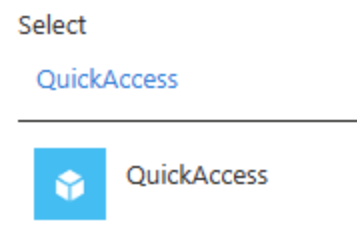

Now that you have setup your Global Secure Access, you can use Conditional Access to add more layers of security and protection. Organizations who use Conditional Access along with the Global Secure Access, can prevent malicious access to Microsoft apps, SaaS apps, and private line-of-business (LoB) apps using multiple conditions to provide defense-in-depth. These conditions might include device compliance, location, and more to provide protection against user identity or token theft.

There are several new types of checks introduced into Conditional Access with Global Secure Access:

| Conditional Access check | What it does |
| :--- | :--- |
| Compliant network check | This compliant network check ensures users connect from a verified network connectivity model for their specific tenant and are compliant with security policies enforced by administrators. |
| Private Access apps | Applying Conditional Access policies to your Microsoft Entra Private Access apps is a powerful way to enforce security policies for your internal, private resources. |
| Source IP restoration | With a cloud based network proxy between users and their resources, the IP address that the resources see doesn't match the actual source IP address. Source IP restoration in Global Secure Access allows backward compatibility for Microsoft Entra customers to continue using original user Source IP. |
| | |

To use the **Compliant network check** and the **Source IP restoration** capabilities, you need to have **Global Secure Access signaling for Conditional Access** enabled. This is step only has to be performed once, so it's listed before we go into the direct Conditional Access options. You perform this step before using any of the below features in Conditional Access.

## Enable Global Secure Access signaling for Conditional Access
To enable the required setting to allow the compliant network check, an administrator must take the following steps.

1. Sign in to the Microsoft Entra admin center as a Global Secure Access Administrator.
1. Browse to Global Secure Access > Global settings > Session management Adaptive access.
1. Select the toggle to Enable CA Signaling for Microsoft Entra ID (covering all cloud apps). Continuous Access Evaluation (CAE) signaling is automatically enabled for Office 365 (preview).
1. Browse to Protection > Conditional Access > Named locations.
 - Confirm you have a location called All Compliant Network locations with location type Network Access. Organizations can optionally mark this location as trusted.

## Compliant Network Check
Compliant network enforcement happens at authentication plane and at the data plane (preview). Microsoft Entra ID performs Authentication plane enforcement at the time of user authentication. Data plane enforcement works with services that support Continuous Access Evaluation (CAE). Currently only Exchange Online and SharePoint Online support this capability. With CAE, you can enforce defense-in-depth with token theft replay protection.

Using this check you can ensure that other organizations using Microsoft's Global Secure Access services can't access your resources.
For example: Contoso can protect their services like Exchange Online and SharePoint Online behind their compliant network check to ensure only Contoso users can access these resources. If another organization like Fabrikam was using a compliant network check, they wouldn't pass Contoso's compliant network check.

**Protect your resources behind the compliant network**
The compliant network Conditional Access policy can be used to protect your Microsoft and other applications. A typical policy will 'Block' access for all network locations except Compliant Network.

1. Sign in to the Microsoft Entra admin center as at least a Conditional Access Administrator. 
1. Browse to Protection > Conditional Access.
1. Select Create new policy.
1. Give your policy a name. We recommend that organizations create a meaningful standard for the names of their policies.
1. Look in Assignments, select Users or workload identities.
 - Under Include, select All users.
 - Under Exclude, select Users and groups and choose your organization's emergency access or break-glass accounts.
1. Look in Target resources > Include, and choose Select apps.
 - Choose Office 365 Exchange Online, and/or Office 365 SharePoint Online, and/or any of your SaaS apps.
 - The specific Office 365 cloud app in the app picker is currently NOT supported, so don't select this cloud app.
1. Explore Conditions > Location.
 - Set Configure to Yes.
 - Under Include, select Any location.
 - Under Exclude, choose Selected locations.
     - Select the All Compliant Network locations location.
 - Choose Select.
1. Under Access controls:
 - Grant, select Block Access, and choose Select.
1. Confirm your settings and set Enable policy to On.
1. Select the Create button to create to enable your policy.

## Conditional Access for Private Access apps
You can create a Conditional Access policy for your Quick Access or Private Access apps from Global Secure Access. Starting the process from Global Secure Access automatically adds the selected app as the Target resource for the policy. All you need to do is configure the policy settings.

1. Sign into the Microsoft Entra admin center as at least a Conditional Access Administrator.
1. Browse to Global Secure Access > Applications > Enterprise applications.
1. Select an application from the list.
1. Select Conditional Access from the side menu. Any existing Conditional Access policies appear in a list.
1. Select Create new policy. The selected app appears in the Target resources details.
1. Configure the conditions, access controls, and assign users and groups as needed.

You see the addition of the Quick Access and Private Access selector from Global Secure Access.

## Source IP Restoration
Source IP restoration in Global Secure Access allows backward compatibility for Microsoft Entra customers to continue using original user Source IP. Administrators can benefit from the following capabilities:

 - Continue to enforce Source IP-based location policies across both Conditional Access and continuous access evaluation.
 - Identity Protection risk detections get a consistent view of original user Source IP address for assessing various risk scores.
 - Original user Source IP is also made available in Microsoft Entra sign-in logs.

**Known limitations**
 - When source IP restoration is enabled, you can only see the source IP. The IP address of the Global Secure Access service isn't visible.
 - Source IP restoration is currently supported for only Microsoft traffic, like SharePoint Online, Exchange Online, Teams, and Microsoft Graph.
 - With CAE’s strict location enforcement, users are blocked despite being in a trusted IP range.

**Enabling**
Source IP Restoration is enabled when you turn on **Global Secure Access signaling**. Further configuration and changes shouldn't be required.

## User exclusions
Conditional Access policies are powerful tools We recommend excluding the following accounts from your policies:

 - **Emergency access or break-glass accounts** to prevent tenant-wide account lockout.
 - **Service accounts and service principals**, such as the Microsoft Entra Connect Sync Account. Service accounts are non-interactive accounts that aren't tied to any particular user.
 - 