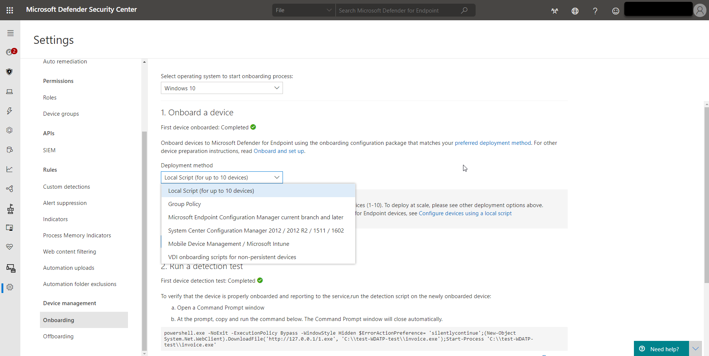

You'll need to go to the onboarding section of the Defender for Endpoint portal to onboard any of the supported devices.  Depending on the device, you'll be guided with appropriate steps and provided management and deployment tool options suitable for the device.

In general, to onboard devices to the service:

- Verify that the device fulfills the minimum requirements

- Depending on the device, follow the configuration steps provided in the onboarding section of the Defender for Endpoint portal

- Use the appropriate management tool and deployment method for your devices

- Run a detection test to verify that the devices are properly onboarded and reporting to the service

>[!VIDEO https://www.microsoft.com/videoplayer/embed/RE4bGqr?rel=0]

In Settings, Device Management, Onboarding select operating system dropdown to see the supported options.

After selecting the operating system option, the supported deployment options are outlined.   Here is a list of the Windows 10 supported deployment options:

- Group Policy

- Microsoft Endpoint Configuration Manager

- Mobile Device Management (including Microsoft Intune)

- Local script

- VDI onboarding script for non-presistent devices

As you can see, there are many configuration options.  

## Offboarding Devices

In Settings, Device Management, Offboarding, select operating system dropdown to see the direction to offboard devices.

