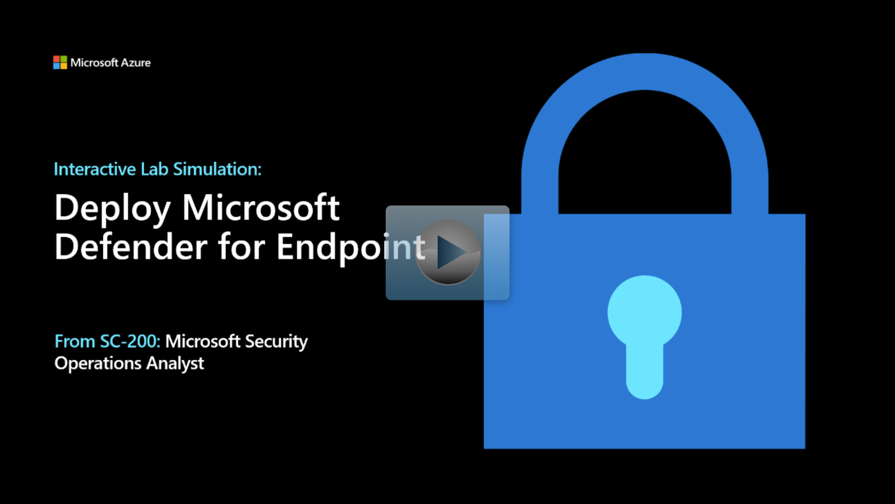

## Configure Device discovery

When accessing your Microsoft 365 Defender portal settings for Endpoints for the first time, the first step is to configure Device discovery. You must be a global administrator or security administrator for the tenant.

1. On the **Microsoft 365 Defender** portal, from the navigation menu, select **Settings** from the left.

1. In the Settings menu page, select Device discovery.

   > [!NOTE]
   > If you do not see the **Device discovery** option under **Settings**, logout by selecting the top-right circle with your account initials and select **Sign out**. Other options that you might want to try is to refresh the page with Ctrl+F5 or open the page InPrivate. Login again with the **Tenant Email** credentials.

1. In Discovery setup, make sure **Standard discovery (recommended)** is selected.

   > [!TIP]
   > If you do not see the option, refresh the page.

:::image type="content" source="../media/settings-device-discovery.png" alt-text="Screenshot of the Settings Device discovery options.":::

## Onboard devices

You need to go to the onboarding section of the Microsoft 365 Defender portal to onboard any of the supported devices.  Depending on the device, you are guided with appropriate steps and provided management and deployment tool options suitable for the device.

In general, to onboard devices to the service:

- Verify that the device fulfills the minimum requirements

- Depending on the device, follow the configuration steps provided in the onboarding section of the Microsoft 365 Defender portal

- Use the appropriate management tool and deployment method for your devices

- Run a detection test to verify that the devices are properly onboarded and reporting to the service

<!--- >>[!VIDEO https://www.microsoft.com/videoplayer/embed/RE4bGqr?rel=0] -->

## Interactive Lab Simulation

> [!NOTE]
> Select the thumbnail image to start the lab simulation. When you're done, be sure to return to this page so you can continue learning.

In Settings, Endpoints, Device management, Onboarding select operating system dropdown to see the supported options.

:::image type="content" source="../media/onboarding.png" alt-text="Screenshot of the Supported Operating Systems dropdown." lightbox="../media/onboarding.png":::

After you select the appropriate operating system option, the supported deployment options are outlined.   Here's a list of the Windows 10 supported deployment options:

- Group Policy

- Microsoft Endpoint Configuration Manager current branch and later

- Mobile Device Management (including Microsoft Intune)

- Local script (for up to 10 devices)

- VDI onboarding script for non-persistent devices

- System Center Configuration Manager 2012 / 2012 R2 / 1511 /1602

:::image type="content" source="../media/onboard-deployment.png" alt-text="Screenshot of the Windows 10 Deployment options." lightbox="../media/onboard-deployment.png":::

As you can see, there are many configuration options.  

## Offboarding devices

In Settings, Endpoints, Device Management, Offboarding, select operating system dropdown to see the direction to offboard devices.

