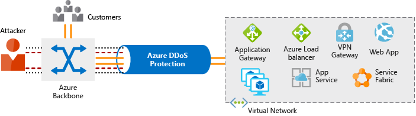

Any company, large or small, can be the target of a serious network attack. The nature of these attacks might be to make a statement, or simply happen because the attacker wanted a challenge.

## Distributed Denial of Service attacks

The aim of a Distributed Denial of Service (DDoS) attack is to overwhelm the resources on your applications and servers, making them unresponsive or slow for genuine users. A DDoS attack will usually target any public-facing endpoint that can be accessed through the internet.

The three most frequent types of DDoS attack are:

- **Volumetric attacks**: These are volume-based attacks that flood the network with seemingly legitimate traffic, overwhelming the available bandwidth. Legitimate traffic can't get through. These types of attacks are measured in bits per second.
- **Protocol attacks**: Protocol attacks render a target inaccessible by exhausting server resources with false protocol requests that exploit weaknesses in layer 3 (network) and layer 4 (transport) protocols.  These types of attacks are typically measured in packets per second.
- **Resource (application) layer attacks**: These attacks target web application packets, to disrupt the transmission of data between hosts.

## What is Azure DDoS Protection?

The Azure DDoS Protection service is designed to help protect your applications and servers by analyzing network traffic and discarding anything that looks like a DDoS attack.  

> [!div class="mx-imgBorder"]
> 

In the diagram above, Azure DDoS Protection identifies an attacker's attempt to overwhelm the network. It blocks traffic from the attacker, ensuring that it doesn't reach Azure resources. Legitimate traffic from customers still flows into Azure without any interruption of service.

Azure DDoS Protection uses the scale and elasticity of Microsoft's global network to bring DDoS mitigation capacity to every Azure region. During a DDoS attack, Azure can scale your computing needs to meet demand. DDoS Protection manages cloud consumption by ensuring that your network load only reflects actual customer usage.

Azure DDoS Protection comes in two tiers:

- **Basic**: The Basic service tier is automatically enabled for every property in Azure, at no extra cost, as part of the Azure platform. Always-on traffic monitoring and real-time mitigation of common network-level attacks provide the same defenses that Microsoft’s online services use. Azure’s global network is used to distribute and mitigate attack traffic across regions.
- **Standard**: The Standard service tier provides extra mitigation capabilities that are tuned specifically to Microsoft Azure Virtual Network resources. DDoS Protection Standard is simple to enable and requires no application changes. Protection policies are tuned through dedicated traffic monitoring and machine learning algorithms. Policies are applied to public IP addresses, which are associated with resources deployed in virtual networks, such as Azure Load Balancer and Application Gateway.

## Azure DDoS pricing

The DDoS Standard Protection service has a fixed monthly charge that includes protection for 100 resources. Protection for additional resources are charged on a monthly per-resource basis.

For more information on pricing, visit the [Azure DDoS Protection pricing page](https://azure.microsoft.com/pricing/details/ddos-protection/).

Use Azure DDoS to protect your devices and applications by analyzing traffic across your network, and taking appropriate action on suspicious traffic.
