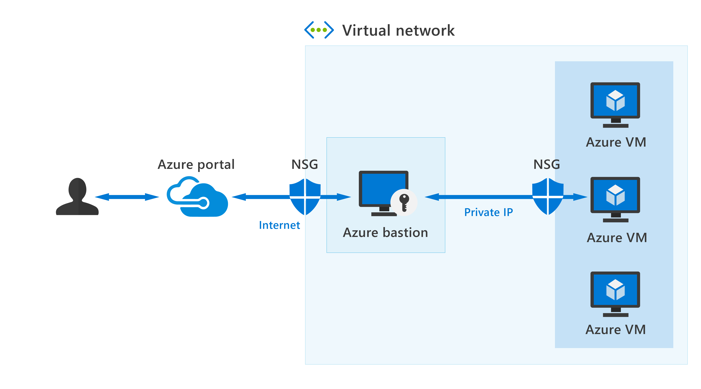

Let’s assume you’ve set up multiple virtual networks that use a combination of NSGs and Azure Firewalls to protect and filter access to the assets and resources, including virtual machines (VMs). You're now protected from external threats, but need to allow your developers and data scientist, who are working remotely, direct access to those VMs.

In a traditional model, you’d need to expose the Remote Desktop Protocol (RDP) and Secure Shell (SSH) ports to the internet. These protocols can be used to gain remote access to your VMs.  This process creates a significant surface threat that can be exploited by attackers.  

> [!div class="mx-imgBorder"]
> 

Azure Bastion provides secure and seamless RDP/SSH connectivity to your virtual machines directly from the Azure portal using Transport Layer Security (TLS). When you connect via Azure Bastion, your virtual machines don't need a public IP address, agent, or special client software.

Bastion provides secure RDP and SSH connectivity to all VMs in the virtual network in which it's provisioned. Using Azure Bastion protects your virtual machines from exposing RDP/SSH ports to the outside world, while still providing secure access using RDP/SSH.

Azure Bastion deployment is per virtual network, not per subscription/account or virtual machine. When you provision an Azure Bastion service in your virtual network, the RDP/SSH experience is available to all your VMs in the same virtual network.

### Key features of Azure Bastion

The following features are available:

- **RDP and SSH directly in Azure portal**: You get to the RDP and SSH session directly in the Azure portal, using a single-click experience.
- **Remote session over TLS and firewall traversal for RDP/SSH**: Use an HTML5-based web client that's automatically streamed to your local device. You'll get your Remote Desktop Protocol (RDP) and Secure Shell (SSH) to traverse the corporate firewalls securely.
- **No Public IP required on the Azure VM**: Azure Bastion opens the RDP/SSH connection to your Azure virtual machine using private IP on your VM. You don't need a public IP.
- **No hassle of managing NSGs**: A fully managed platform PaaS service from Azure that's hardened internally to provide secure RDP/SSH connectivity. You don't need to apply any NSGs on an Azure Bastion subnet.
- **Protection against port scanning**: Because you don't need to expose your virtual machines to the internet, your VMs are protected against port scanning by rogue and malicious users located outside your virtual network.
- **Protect against zero-day exploits**: A fully platform-managed PaaS service. Because it sits at the perimeter of your virtual network, you don’t need to worry about hardening each virtual machine in the virtual network. The Azure platform protects against zero-day exploits by keeping the Azure Bastion hardened and always up to date for you.

Use Azure Bastion to establish secure RDP and SSH connectivity to your virtual machines in Azure.
