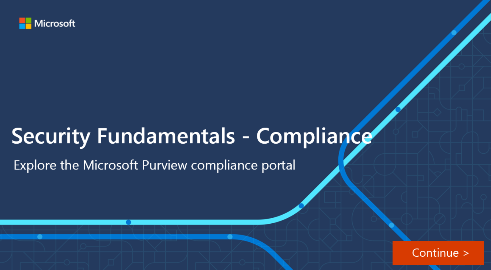

The Microsoft Purview compliance portal brings together all of the tools and data that are needed to help understand and manage an organization’s compliance needs.

The compliance portal is available to customers with a Microsoft 365 SKU with one of the following roles:

- Global administrator
- Compliance administrator
- Compliance data administrator

When an admin signs in to the Microsoft Purview compliance portal, the card section on the home page shows, at a glance, how your organization is doing with data compliance, what solutions are available for your organization, and a summary of any active alerts.  Admins can customize the card section by moving cards around or adding/removing cards that are displayed on the home screen.

:::image type="content" source="../media/purview-compliance-portal-inline.png" lightbox="../media/purview-compliance-portal-expanded.png" alt-text="Screen shot of the Microsoft Purview compliance portal dashboard.":::

The default compliance portal home page contains several cards including:

- The **Compliance Manager** card. This card leads you to the Microsoft Purview Compliance Manager solution. Compliance Manager helps simplify the way you manage compliance. It calculates a risk-based compliance score that measures progress toward completing recommended actions to reduce risks associated with data protection and regulatory standards. The Compliance Manager solution also provides workflow capabilities and built-in control mapping to help you efficiently carry out improvement actions.

  :::image type="content" source="../media/compliance-manager-card-inline.png" lightbox="../media/compliance-manager-card-expanded.png" alt-text="Screen shot of the Compliance Manager card showing your compliance score.":::

- The **Solution catalog** card links to collections of integrated solutions to help you manage end-to-end compliance scenarios. Solutions areas included:
  - **Information protection & governance**.  These solutions help organizations classify, protect, and retain your data where it lives and wherever it goes. Included are data lifecycle management, data loss prevention, information protection, and records management.
  - **Privacy**.  Build a more privacy-resilient workplace.  Privacy management gives actionable insights on your organization's personal data to help you spot issues and reduce risks.
  - **Insider risk management**. These solutions help organizations identify, analyze, and remediate internal risks before they cause harm. Included are communication compliance, information barriers, and insider risk management.
  - **Discovery & response**.  These solutions help organizations quickly find, investigate, and respond with relevant data. Included are Audit, data subject requests, and eDiscovery.

  :::image type="content" source="../media/3-solutions-catalog-card-inline.png" lightbox="../media/3-solutions-catalog-card-expanded.png" alt-text="Screen shot of the solutions catalog card.":::

- The **Active alerts** card includes a summary of the most active alerts and a link where admins can view more detailed information, such as alert severity, status, category, and more.

    :::image type="content" source="../media/3-active-alerts-card.png" alt-text="Screen shot of the active alerts card.":::

## Navigation

In addition to the cards on the home page, there’s a navigation pane on the left of the screen that gives easy access to the Compliance Manager and the Data Classification page where you can get snapshots of how sensitive information and labels are being used across your organization's locations. You can access alerts, reports, policies, and all the solutions that are included in the solutions catalog.  There's access to data connectors that you can use to import non-Microsoft data to Microsoft 365 so it can be covered by your compliance solutions. The **Customize navigation** control allows customization of which items appear in the navigation pane.

:::image type="content" source="../media/purview-portal-navigation-v2-inline.png" lightbox="../media/purview-portal-navigation-v2-expanded.png" alt-text="Screen shot of the compliance portal left navigation panel.":::

## Interactive guide

In this interactive guide, you'll explore some of the capabilities of the Microsoft Purview compliance portal, your home for managing compliance needs using integrated solutions for information protection, data lifecycle management, insider risk management, discovery, and more. Select the image that follows to get started and follow the prompts on the screen.

> [!NOTE]
> The user interface (UI) in Microsoft 365 is continually evolving so the UI shown in the interactive guide may not reflect the most recent updates.

