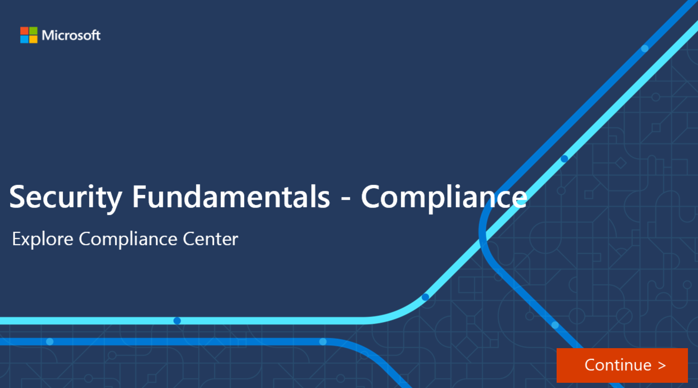

The Microsoft 365 Compliance Center brings together all of the tools and data that are needed to help understand and manage an organization’s compliance needs.

Compliance Center is available to customers with a Microsoft 365 SKU with one of the following roles:

- Global administrator role
- Compliance administrator role
- Compliance data administrator

When an admin signs in to the Microsoft 365 Compliance Center portal, they’ll get a bird’s-eye view of how the organization is meeting its compliance requirements, along with which solutions can be used to help with compliance, information about any active alerts, and more:

:::image type="content" source="../media/3-compliance-center-dashboard-inline.png" lightbox="../media/3-compliance-center-dashboard-expanded.png" alt-text="Microsoft Compliance Center dashboard":::

The default Compliance Center homepage contains several cards including:

- The **compliance score** card. This card shows the compliance score, and will forward admins to the Compliance Manager where they can see a breakdown of the compliance score..  Compliance score measures the progress in completing recommended improvement actions within controls. The score can help an organization to understand its current compliance posture. It can also help an organization to prioritize actions based on their potential to reduce risk.

    :::image type="content" source="../media/3-compliance-score-card-inline.png" lightbox="../media/3-compliance-score-card-expanded.png" alt-text="The compliance score card":::

- The new **Solution catalog** card, links to collections of [integrated solutions](https://docs.microsoft.com/microsoft-365/compliance/microsoft-365-solution-catalog?view=o365-worldwide) that can be used to manage end-to-end compliance scenarios across three compliance solutions areas:
    - The **Information protection & governance** section shows you at a glance how you can use Microsoft 365 compliance solutions to protect and govern data in your organization.
    - The **Insider risk management** section on the home page shows you how your organization can identify, analyze, and act on internal risks before they cause harm.
    - The **Discovery & respond section** on the home page shows how your organization can quickly find, investigate, and respond to compliance issues with relevant data.

    A solution's capabilities and tools might include a combination of policies, alerts, reports, and more.

    :::image type="content" source="../media/3-solutions-catalog-card-inline.png" lightbox="../media/3-solutions-catalog-card-expanded.png" alt-text="Solutions catalog card":::

- The **Active alerts** card, includes a summary of the most [active alerts](https://docs.microsoft.com/microsoft-365/compliance/alert-policies?view=o365-worldwide) and includes a link where admins can view more detailed information, such as alert severity, status, category, and more.

    :::image type="content" source="../media/3-active-alerts-card.png" alt-text="Active alerts card":::

## Navigation

In addition to the cards on the home page, there’s a navigation pane on the left side of the screen that gives easy access to [alerts](https://docs.microsoft.com/microsoft-365/security/office-365-security/alerts?view=o365-worldwide), [reports](https://docs.microsoft.com/microsoft-365/compliance/reports-in-security-and-compliance?view=o365-worldwide), [policies](https://docs.microsoft.com/microsoft-365/compliance/alert-policies?view=o365-worldwide), compliance solutions, and more. To add or remove options for a customized navigation pane, the **Customize navigation** control on the navigation pane can be used to configure which items appear in the navigation pane.

:::image type="content" source="../media/3-left-navigation-pane-inline.png" lightbox="../media/3-left-navigation-pane-expanded.png" alt-text="Compliance Center left navigation pane":::

## Interactive guide

In this interactive guide, you will explore some of the capabilities of the Microsoft 365 Compliance Center, your home for managing compliance needs using integrated solutions for information protection, information governance, insider risk management, discovery, and more:

