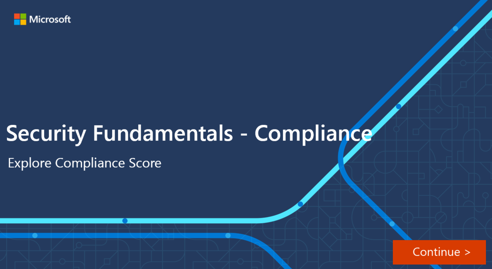

Compliance score measures progress in completing recommended improvement actions within controls. The score can help an organization to understand its current compliance posture. It also helps organizations to prioritize actions based on their potential to reduce risk.

Admins can get a breakdown of the compliance score in the Compliance Manager overview pane:

:::image type="content" source="../media/5-compliance-score-home-page-inline.png" lightbox="../media/5-compliance-score-home-page-expanded.png" alt-text="A breakdown of compliance score":::

## What is the difference between Compliance Manager and compliance score?

Compliance Manager is an end-to-end solution in Microsoft 365 compliance center to enable admins to manage and track compliance activities.  Compliance score is a calculation of the overall compliance posture across the organization. The compliance score is available through Compliance Manager.

Compliance Manager gives admins the capabilities to understand and increase their compliance score, so they can ultimately improve the organization’s compliance posture and help it to stay in line with compliance requirements.

## How to understand the compliance score

The overall compliance score is calculated using scores that are assigned to actions. Actions come in two types:

1. **Your improved actions**: actions that the organization is expected to manage.
1. **Microsoft actions**: actions that Microsoft manages for the organization.

These action types have points assigned to them that count towards the compliance score. Actions can also be considered technical or nontechnical, which also affects how they impact the overall compliance score. Actions are also assigned a score value based on whether they’re categorized as mandatory, discretionary, preventative, detective, or corrective:

- **Mandatory** – these actions shouldn’t be bypassed. For example, creating a policy to set requirements for password length or expiration.
- **Discretionary** – these actions depend on the users understanding and adhering to a policy. For example, a policy where users are required to ensure their devices are locked before they leave them.

The following are subcategories of actions that can be classified as mandatory or discretionary:

- **Preventative** actions are designed to handle specific risks, like using encryption to protect data at rest if there were breaches or attacks.
- **Detective** actions actively monitor systems to identify irregularities that could represent risks, or that can be used to detect breaches or intrusions. Examples of these types of actions are system access audits, or regulatory compliance audits.
- **Corrective** actions help admins to minimize the adverse effects of security incidents, by undertaking corrective measures to reduce their immediate effect or possibly even reverse damage.

:::image type="content" source="../media/5-compliance-score-calculation-inline.png" lightbox="../media/5-compliance-score-calculation-expanded.png" alt-text="How compliance score can be calculated":::

Actions that are mandatory and preventative, with 27 points, provide the highest points value towards your compliance score.
Organizations accumulate points for every action completed. And the compliance score is shown as a percentage representing all the actions completed, compared with the ones outstanding:

:::image type="content" source="../media/5-compliance-score-details-inline.png" lightbox="../media/5-compliance-score-details-expanded.png" alt-text="Example of a compliance score":::

## Interactive guide

In this interactive guide, you’ll explore your organization’s compliance score, and the tools you can use to improve it:

