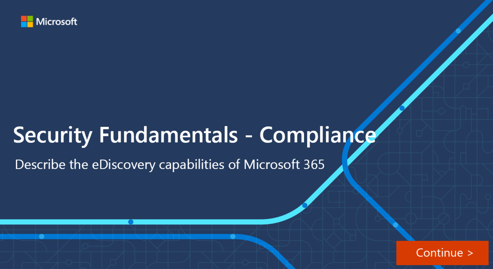

Electronic discovery, or eDiscovery, is the process of identifying and delivering electronic information that can be used as evidence in legal cases. You can use eDiscovery tools in Microsoft 365 to search for content in Exchange Online, OneDrive for Business, SharePoint Online, Microsoft Teams, Microsoft 365 Groups, and Yammer teams. You can search mailboxes and sites in the same eDiscovery search, and then export the search results. You can use Core eDiscovery cases to identify, hold, and export content found in mailboxes and sites. 

Microsoft 365 provides three eDiscovery solutions: Content search, Core eDiscovery, and Advanced eDiscovery.

:::image type="content" source="../media/m365-ediscovery-solution-inline.png" lightbox="../media/m365-ediscovery-solution-expanded.png" alt-text="Microsoft 365 eDiscovery solution components, Search, Core eDiscovery, and Advanced eDiscovery.":::

- **Content Search**. Use the Content search tool to search for content across Microsoft 365 data sources and then export the search results to a local computer.

- **Core eDiscovery**. Core eDiscovery builds on the basic search and export functionality of Content search by enabling you to create eDiscovery cases and assign eDiscovery managers to specific cases. Core eDiscovery also lets you associate searches and exports with a case and lets you place an eDiscovery hold on content locations relevant to the case.

- **Advanced eDiscovery**. The Advanced eDiscovery tool builds on the existing capabilities in Core eDiscovery. Advanced eDiscovery provides an end-to-end workflow to identify, preserve, collect, review, analyze, and export content that's responsive to your organization's internal and external investigations. It lets legal teams manage custodians, people that you've identified as people of interest in the case, and the workflow to communicate with custodians. It allows you to collect and copy data into review sets, where you can filter, search, and tag content so you can identify and focus on content that's most relevant. Advanced eDiscovery provides analytics and machine learning-based predictive coding models to further narrow to scope of your investigation to the most relevant content.

Subscriptions that support Core eDiscovery also support Content search. Subscriptions that support Advanced eDiscovery also support Content search and Core eDiscovery.

To access any of the eDiscovery-related tools, a user must be assigned the appropriate permissions. Specifically, a user must be added as a member of the eDiscovery Manager role group in the Microsoft 365 compliance center.

### Interactive guide

In this interactive guide, you'll explore some of the capabilities of core eDiscovery. Select the image below to get started and follow the prompts on the screen.

