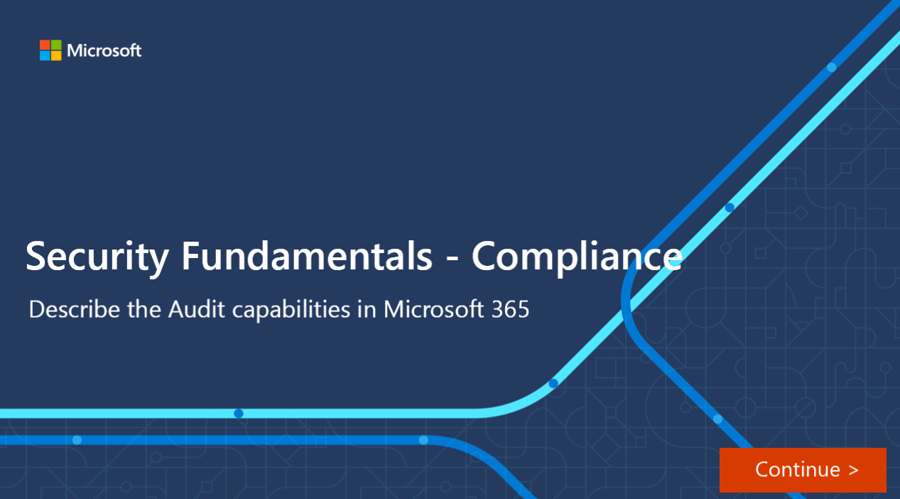

Microsoft 365 auditing solutions provide an integrated solution to help organizations effectively respond to security events, forensic investigations, internal investigations, and compliance obligations. Thousands of user and admin operations performed in dozens of Microsoft 365 services and solutions are captured, recorded, and retained in your organization's unified audit log. Audit records for these events are searchable by security ops, IT admins, insider risk teams, and compliance and legal investigators in your organization. This capability provides visibility into the activities performed across your Microsoft 365 organization.

Microsoft 365 provides two auditing solutions: Basic Audit and Advanced Audit.

:::image type="content" source="../media/audit-solutions-inline.png" lightbox="../media/audit-solutions-expanded.png" alt-text="Microsoft 365 audit solution components, basic audit and advanced audit.":::

- **Basic Audit**. Basic Audit provides with you with the ability to log and search for audited activities and power your forensic, IT, compliance, and legal investigations. Basic Audit is turned on by default for all organizations with the appropriate subscription. You can search for a wide-range of audited activities that occur in most of the Microsoft 365 services in your organization. Audit records can also be retrieved using the Office 365 Management Activity API. You can export the audit records returned by the search, to a CSV file, enabling further analysis using Microsoft Excel or Excel Power Query. In Basic Audit, records are retained for 90 days. 

- **Advanced Audit**. Advanced Audit builds on the capabilities of Basic Audit.  Advanced Audit provides audit log retention policies and longer retention of audit records. It provides audit records for high-value crucial events that can help your organization investigate possible security or compliance breaches and determine the scope of compromise. Advanced Audit also provides organizations with more bandwidth to access auditing logs through the Office 365 Management Activity API.

It can take up to 30 minutes or up to 24 hours after an event occurs for the corresponding audit log record to be returned in the results of an audit log search.

Licensing for Basic or advanced Audit requires the appropriate organization-level subscription and corresponding per-user licensing. For additional information on licensing requirements, visit the Learn more section in the Summary and resources  unit.

Admins and members of investigation teams must be assigned the View-Only Audit Logs or Audit Logs role in Exchange Online to search the audit log. By default, these roles are assigned to the Compliance Management and Organization Management role groups on the Permissions page in the Exchange admin center.

### Interactive guide

In this interactive guide, you'll explore some of the capabilities of basic audit. Select the image below to get started and follow the prompts on the screen.

