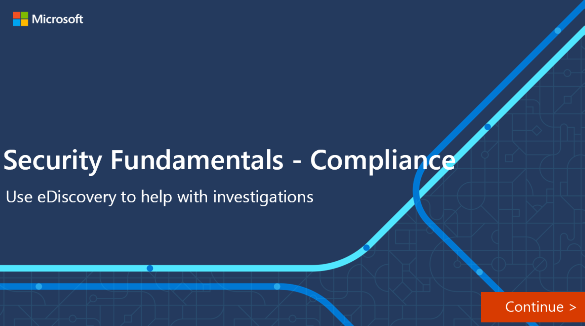

Core eDiscovery in Microsoft 365 provides a basic eDiscovery tool that organizations can use to search and export content in Microsoft 365.

To access Core eDiscovery or be added as a member of a Core eDiscovery case, a user must be assigned the appropriate permissions. Specifically, a user must be added as a member of the **eDiscovery Manager role** group in the Office 365 Security & Compliance Center.

You start by creating an eDiscovery case. A case is created from within **Microsoft 365 compliance center**. When you create a case, you must specify a name for the case and optionally define a case number. Once you have created, you can assign members to the case. From that point on the case will be displayed in the eDiscovery page and the user can step through the workflow.

The workflow consists of creating holds, searching for content, and exporting and downloading search results.

:::image type="content" source="../media/4-core-ediscovery-workflow-inline.png" lightbox="../media/4-core-ediscovery-workflow-expanded.png" alt-text="The Core eDiscovery workflow.":::

## Create an eDiscovery hold

You can use an eDiscovery case to create a hold to preserve content that might be relevant to the case. You can place a hold on the Exchange mailboxes and OneDrive for Business accounts of people you're investigating in the case. You can also place a hold on the mailboxes and sites that are associated with Microsoft Teams, Office 365 Groups, and Yammer Groups. When you place content locations on hold, content is preserved until you remove the hold from the content location or until you delete the hold.

It may take up to 24 hours after you create the hold for it to take effect.

You have two options to scope the content that is preserved:

- You create an infinite hold where all content in the specified locations is placed on hold. Alternatively, you can create a query-based hold where only the content in the specified locations that matches a search query is placed on hold.
- You can specify a date range to preserve only the content that was sent, received, or created within that date range. Alternatively, you can hold all content in specified locations regardless of when it was sent, received, or created.

## Search for content in the case

Once you have placed a hold, you can create and run searches for content relative to the case. You initiate the search from within the home page for that specific case. Searches associated with a case can only be accessed by members assigned to that case.

You can specify keywords, message properties such as sent and received dates, or document properties such as file names or the date a document was last changed. You can use Boolean operators such as **AND**, **OR**, **NOT**, or **NEAR**. In addition, you can search for sensitive information (for example, social security numbers) in documents, or search for documents that have been shared externally. If you do not specify keywords, all content located in the specified content locations will be included in the search results.

## Export content from a case

You can export search results. When you export search results, mailbox items are downloaded in a PST file or as individual messages. Content from SharePoint, OneDrive for Business sites, copies of native Office documents, as well as other documents are exported. A Results.csv file that contains information about every item that's exported and a manifest file (in XML format) that contains information about every search result is also exported.

You can export the results of both a single search or results from multiple searches associated with a case.

## Close, reopen, and delete a core eDiscovery case

Core eDiscovery cases can be closed when the investigations or legal cases they were supporting have been completed. When a case is closed, any holds associated with the case will be turned off.  Once turned off, there’s a 30-day grace day period (referred to as a delay hold) on the content locations that were on hold. This helps ensure that content isn’t deleted immediately and gives admins the chance to look for and restore any content before it is deleted permanently at the end of the grace period.

The main difference between an active and closed case is that eDiscovery holds are turned off for a closed case.
When you reopen a closed case, any holds that were in place when it was closed, won’t be reinstated automatically.  After reopening the case, you’ll need to turn on previous holds.  A reopened case will have its status changed from closed to active.

You can delete both active and closed cases. If you delete a case, all searches and exports in that case are also deleted, the case is removed from the list of cases in the Microsoft 365 Compliance Center, and the deleted case can’t be reopened.

If the case you want to delete contains eDiscovery holds, you won’t be able to delete it. You’ll need to delete all the holds linked to the case and try and delete it again.

### Interactive guide

As the admin for your organization, you've be asked to help with an ongoing investigation. For example, you need to collect information on whether a user has sent emails about the Winter project that is currently the subject of the investigation. The following interactive clickthrough demonstrates how you can do this using the Core eDiscovery workflow.

