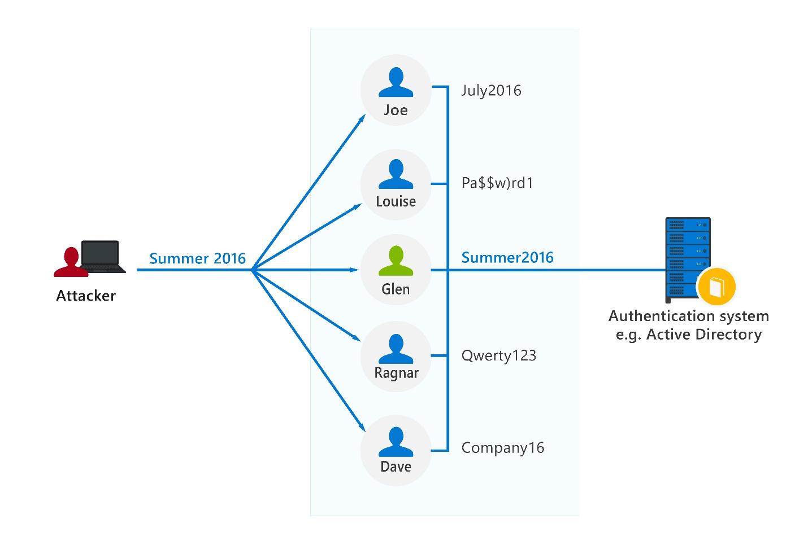

Some of the most common types of security threats that organizations face today are identity attacks.  These attacks are designed to steal the credentials used to validate or authenticate that someone or something is who they claim to be. The result is identity theft.

## Password-based attacks

Many password-based attacks employ brute force techniques to gain unauthorized access.  In a brute force attack, an attacker will attempt to gain access simply by trying different usernames and password combinations. Typically, attackers have tools that automate this process by using millions of username and password combinations.  Attackers may also use a dictionary of commonly used passwords in their approach

Other variations of brute force attacks include password spray attacks and credential stuffing. In credential stuffing, the attacker takes advantage of the fact that many people use the same username and password across many sites and will use known, stolen credentials, usually obtained after a data breach on one site, to attempt to access other accounts.

In password spray attacks, the attacker will typically apply (spray) a commonly used password against many different accounts.  Limiting the technique to using a single commonly used password against many accounts, helps prevent accounts from being locked, due to repeated failed login attempts.

Although both credential stuffing and password spray attacks are variations of a brute force attack, a key distinction is that credential stuffing uses a known, stolen password as against many different accounts, while a password spray attack uses a commonly used password against many accounts.

## Phishing

A phishing attack is when a hacker sends an email that appears to come from a reputable source. The email contains a credible story, such as a security breach, instructing the user to sign in and change their password. Instead of going to a legitimate website, the user is directed to the scammer’s website where they enter their username and password. The hacker has now captured the user’s identity, and their password.

Although many phishing scam emails are badly written and easy to identify, when users are busy or tired, they make mistakes and are more easily deceived. As hackers become more sophisticated, their phishing emails become more difficult to identify.

### Spear phishing

A spear phishing scam is a variant on phishing. Hackers build databases of information about users, which can be used to create highly credible emails. The email may appear to come from someone in your organization who is requesting information. Although careful scrutiny might uncover the fraud, users may not read it carefully enough and send the requested information or login to the website before they realize the fraud. This practice is called spear phishing because it's highly targeted.

To protect against all types of identity attacks, robust identity security and monitoring are needed.
Risk detections in Azure AD Identity Protection include any identified suspicious actions related to user accounts.

There are two types of risk: **user risk** and **sign-in risk**. **User risk** represents the probability that a given identity or account is compromised. **Sign-in risk** represents the probability that a given authentication request isn't authorized by the identity owner.
