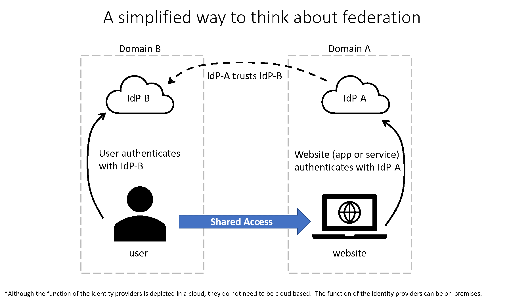

Federation enables the access of services across organizational or domain boundaries by establishing trust relationships between the respective domain’s identity provider.  With federation, there's no need for a user to maintain a different username and password when accessing resources in other domains.

The simplified way to think about this federation scenario is as follows:

- The website, in domain A, uses the authentication services of Identity Provider A (IdP-A).
- The user, in domain B, authenticates with Identity Provider B (IdP-B).
- IdP-A has a trust relationship configured with IdP-B.
- When the user, who wants to access the website, provides his/her credentials to the website, the website trusts the user and allows access.   This access is allowed because of the trust that is already established between the two identity providers.

With federation, trust isn't always bidirectional.  Although IdP-A may trust IdP-B and allow the user in domain B to access the website in domain A, the opposite isn't true, unless that trust relationship is configured.

A common example of federation in practice is when a user logs in to a third-party site with their social media account, such as Twitter.  In this scenario, Twitter is an identity provider, and the third-party site might be using a different identity provider, such as Azure AD. There's a trust relationship between Azure AD and Twitter.
