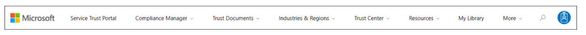

The Service Trust Portal provides information, tools, and other resources about Microsoft security, privacy, and compliance practices. Sign in with your Microsoft cloud services account to access all the available documentation.

From the main menu, you have access to:

- **Service Trust Portal** – home page.
- **Compliance Manager** – measures your progress in completing actions that help reduce risks around data protection and regulatory standards. To learn more, see the Microsoft Compliance Manager documentation in the Learn More section below.
- **Trust Documents** – links to a security implementation and design information.
- **Industries & Regions** – contains compliance information about Microsoft Cloud services organized by industry, and region. The Industry Solutions link currently displays the home page for Financial Services. The Regional Solutions links currently have information for: Australia, Canada, Czech Republic, Denmark, Germany, Poland, Romania, Spain, and the United Kingdom.
- **Trust Center** - links to the Microsoft Trust Center, which provides more information about security, compliance, and privacy in the Microsoft Cloud.
- **Resources** - links to resources including Information about the features and tools available for data governance and protection in Office 365, the Microsoft Global Datacenters, and Frequently Asked Questions.
- **My Library** - allows you to add documents and resources that are relevant to your organization, everything is in one place. You can also opt to have email notifications sent when a document is updated, as well as the frequency you receive notifications.

## Walkthrough of the Service Trust Portal

In this unit, you will explore the Service Trust Portal. You will need a Microsoft Azure cloud services account or Microsoft 365 account. You can take out an Azure free trial. When you sign up for a free trial, you must enable Azure Active Directory. For more information, see Free Trial in the Learn More section below.

The Service Trust Portal provides information, tools, and other resources about Microsoft security, privacy, and compliance practices. Sign in with your Microsoft cloud services account to access all the available documentation. For more information, see Service Trust Portal in the Learn More section below.

## Task 1: Save a document to My Library

1. Go to The Service Trust Portal and sign in with your Microsoft Azure cloud services account.
1. Widen the screen so you can see all the available options on the Main Menu.

    

1. Scroll down and select **View all Audit Report**. The Audit Reports page is displayed
1. Sign in again with your Microsoft Azure cloud service account.
1. Click the down arrow next to Cloud Service and select **Azure**.
1. Click to select the displayed document.
1. Click **Save to Library** and when prompted select **Confirm**.
1. The Notification Settings dialog box is displayed. Select **Yes** to receive email notifications and check that the **email address** is correct. Select the frequency for notifications.
1. Select **Cancel** so that your changes aren't saved.

:::image type="content" source="../media/3-my-library-notification-settings.png" alt-text="My Library notification settings":::

### Explore Compliance Manager

1. Go to The Service Trust Portal and sign in with your Microsoft Azure cloud services account.
1. From the main menu, select **Compliance Manager** > **Compliance Manager**. If Compliance Manager is not shown on the menu, select the **More** menu option.
1. Sign in with your Microsoft Azure cloud service account again. The Compliance Manager dashboard is displayed.
1. View the **Compliance Score**, then scroll down to learn how your Compliance score is calculated. Select **View All Solutions** to see your current and potential score for various solutions.
1. From the menu, select **Improvement actions** to view actions you can take to improve your compliance score.
1. Take a minute to familiarize with Compliance Manager.
1. Select the **Account** icon and then select **Sign Out**.

Congratulations! In this walkthrough, you accessed the Service Trust Portal and Compliance Manager.
