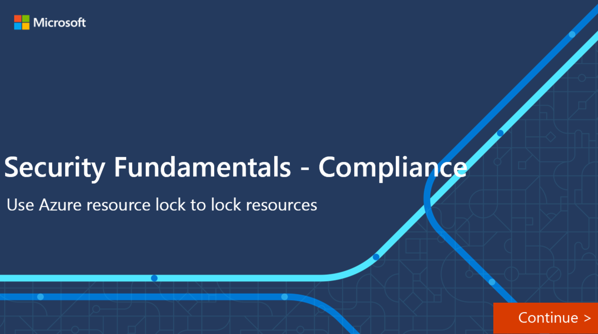

Before we can describe the use of Azure Resource Manager locks, it is important to first understand what Azure Resource Manager is.  Azure Resource Manager is the deployment and management service for Azure. Azure Resources Manager provides a management layer that enables administrators to create, update, and delete resources in an Azure account. Admins can use management features such resource locks to secure resources after deployment.

Resource locks can be used to prevent resources from being accidentally deleted or changed. Even with role-based access control policies in place there is still a risk that people with the right level of access could delete a critical resource.  Azure Resource Manager locks prevent users from accidentally deleting or modifying a critical resource, and can be applied to a subscription, a resource group, or a resource. For example, there may be times when an administrator needs to lock a subscription, a resources group, or a resource. A lock would be applied in these situations to prevent users from accidentally deleting or modifying a critical resource.

A lock level can be set to **CanNotDelete** or **ReadOnly**. In the portal, the locks are called **Delete** and **Read-only** respectively.

- **CanNotDelete** means authorized users can still read and modify a resource, but they can't delete the resource.
- **ReadOnly** means authorized users can read a resource, but they can't delete or update the resource. Applying this lock is similar to restricting all authorized users to the permissions granted by the Reader role.

A resource can have more than one lock. For example, a resource may have a ReadOnly lock and a CanNotDelete lock. When you apply a lock at a parent scope, all resources within that scope inherit that lock. Even resources you add later inherit the lock from the parent. The most restrictive lock in the inheritance takes precedence.

Resource Manager locks apply only to operations that happen in the management plane. The locks don't restrict how resources perform their functions. If a lock is applied, changes to the actual resource are restricted, but resource operations aren't restricted. For example, a ReadOnly lock on an Azure SQL Database logical server prevents deletion or modification of the server. However, it doesn't prevent you from creating, updating, or deleting data in the databases on that server.

## Interactive guide

A development team in your organization uses an Azure Storage account to store some of their content. As the Azure administrator, you’ve been asked to help ensure that the storage account can’t be deleted. In this interactive demonstration, you’ll lock a storage account, verify the lock works, and then remove the lock.

