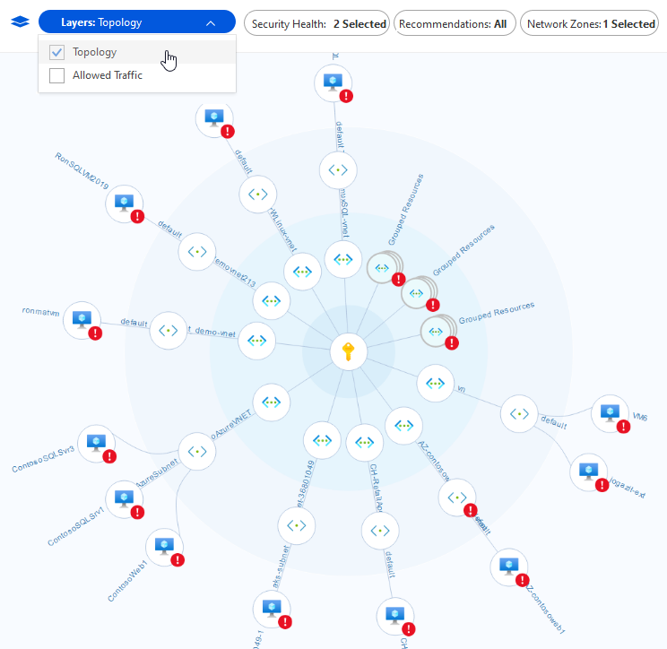

Network security is an ever-changing and shifting battleground where a moment's hesitation can allow cybercriminals to compromise your security perimeter, and steal valuable assets and resources. Using Azure Security Center gives you infrastructure level security management to protect your data. It also provides advanced threat protection for on-premises, cloud, and hybrid workloads in the cloud, whether they're in Azure or not, as well as on-premises. Azure Security Center provides the tools you need to harden your network, secure services, and ensure you're on top of your security posture.

Azure Security Center addresses the three most urgent security challenges:

- **Rapidly changing workloads**: As organizations empower users to do more, the challenge is to ensure that the ever-changing services people use and create meet your security standards and follow best practices.
- **Increasingly sophisticated attacks**: Wherever your work is situated, the attacks keep getting more sophisticated. Securing your public internet-facing services is essential; otherwise, you'll be even more vulnerable.
- **Security skills are in short supply**: The number of security alerts and alerting systems far outnumbers the total of administrators who have the necessary background and experience to ensure your environments are protected.

To help protect against these challenges, Azure Security Center provides tools to:

- **Strengthen security posture**: Security Center assesses your environment and enables you to understand the status of your resources and whether they're secure.

- **Protect against threats**: Security Center assesses your workloads and raises threat prevention recommendations and security alerts.

- **Get secure faster**: In Security Center, everything is done in cloud speed. Because it's natively integrated, Security Center deployment is easy, giving you autoprovisioning and protection with Azure services.

Also, Security Center protects non-Azure servers and virtual machines in the cloud or on-premises, for both Windows and Linux servers, by installing the Log Analytics agent. Azure virtual machines are autoprovisioned in Security Center.

### Strengthen your security posture

You can improve your security posture using Azure Security Center to identify and perform hardening tasks across your machines, data services, and applications. With Azure Security Center, you can manage and enforce security policies to ensure compliance across your virtual machines, non-Azure servers, and Azure PaaS services.

### Continuous assessment

Security Center brings continuous assessment of your entire estate, discovering and reporting whether new and existing resources and assets are configured according to security compliance requirements. You’ll get an ordered list of recommendations of what needs to be fixed to maintain maximum protection. Security Center groups the recommendations into security controls and adds a secure score value to each control. This process is crucial in enabling you to prioritize security work.

> [!div class="mx-imgBorder"]
> 

### Network map

One of the most powerful Security Center tools for continuously monitoring the security status of your network is the network map. Use the map to look at the topology of your workloads, so you can see if each node is properly configured. You'll see how your nodes are connected, which helps you block unwanted connections that could potentially make it easier for an attacker to creep along your network.

> [!div class="mx-imgBorder"]
> 

### Protect against threats

With Azure Security Center’s threat protection, you can detect and prevent threats on infrastructure as a service (IaaS), non-Azure servers, and platform as a service (PaaS). It comes with these features:

- **Integration with Microsoft Defender**: Security Center natively integrates with Microsoft Defender for Endpoint.
- **Protect PaaS**: Security Center helps you detect threats across Azure PaaS services. You can detect threats targeting Azure services, including Azure App Service, Azure SQL, Azure Storage Account, and more data services.
- **Block brute force attacks**: By reducing access to virtual machine ports, using the just-in-time VM access, you can harden your network by preventing unnecessary access.
- **Protect data services**: Get assessments for potential vulnerabilities across Azure SQL and Storage services and recommendations for mitigating them.

Security Center's threat protection automatically correlates alerts in your environment based on cyber kill-chain analysis. It helps you to better understand the full story of an attack campaign, where it started and the impact it had on your resources.

### Get secure faster

With Security Center, organizations can get secure faster through integration with other Microsoft security solutions. Also, integration with Azure and its resources means you'll pull together a complete security story involving Azure Policy and built-in Security Center policies across all your Azure resources. You then ensure that the whole thing is automatically applied to newly discovered resources as you create them in Azure.
