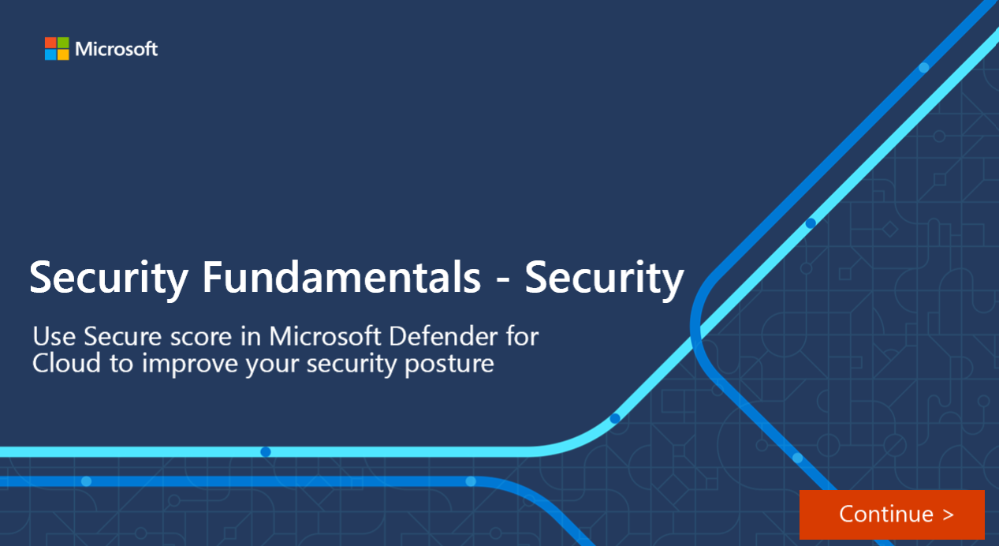

One of Microsoft Defender for Cloud's main pillars for cloud security is Cloud Security Posture Management (CSPM). CSPM provides you with hardening guidance that helps you efficiently and effectively improve your security. CSPM also gives you visibility into your current security situation.

#### Secure score

The central feature in Microsoft Defender for Cloud that provides visibility to your current security posture is secure score. Defender for Cloud continually assesses your cross-cloud resources for security issues. It then aggregates all the findings into a single score so that you can tell, at a glance, your current security situation: the higher the score, the lower the identified risk level.

All Defender for Cloud customers automatically gain access to the secure score when they enable Defender for Cloud. Microsoft Cloud Security Benchmark (MCSB) is automatically applied to your environments and generates all the built-in recommendations that are part of this default initiative.

:::image type="content" source="../media/single-secure-score-via-ui.png" alt-text="Screenshot showing part of Microsoft Defender for Cloud secure score for a multicloud environment.":::

#### Hardening recommendations

Microsoft Defender for Cloud also provides hardening recommendations based on any identified security misconfigurations and weaknesses. Recommendations are grouped into security controls. Each control is a logical group of related security recommendations, and reflects your vulnerable attack surfaces. Your score only improves when you remediate all of the recommendations for a single resource within a control. Use these security recommendations to strengthen the security posture of your organization's Azure, hybrid, and multicloud resources.

:::image type="content" source="../media/3-security-center-recommendations-inline.png" lightbox="../media/3-security-center-recommendations-expanded.png" alt-text="Screenshot showing part of Microsoft Defender for Cloud with recommendations as to what needs to be fixed to maintain maximum protection.":::

The following interactive click-through demonstrates how you use secure score and the hardening recommendations in Microsoft Defender for Cloud.  Select the image to get started and follow the prompts on the screen.

### Defender CSPM plan options

Defender for Cloud offers foundational multicloud CSPM capabilities for free. These capabilities are automatically enabled by default on any subscription or account that has onboarded to Defender for Cloud. The foundational CSPM includes asset discovery, continuous assessment and security recommendations for posture hardening, compliance with Microsoft Cloud Security Benchmark (MCSB), and secure score.

The optional Defender CSPM plan provides advanced posture management capabilities and tools to assess your security compliance with a wide range of benchmarks, regulatory standards, and any custom security policies.  For a complete list of features in foundational and advanced Defender CSPM Plans, see [Defender CSPM plan options](/azure/defender-for-cloud/concept-cloud-security-posture-management#plan-availability).
