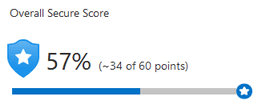
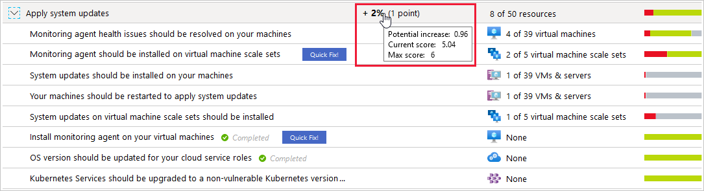

Security Center continually assesses your resources, subscriptions, and organization for security issues. It then aggregates all the findings into a single score so you can quickly see your current security situation: the higher the score, the lower the identified risk level.

The secure score is shown in the Azure portal pages as a percentage value. The underlying values are also clearly presented:

> [!div class="mx-imgBorder"]
> 

To increase your security and raise your score, review Security Center's recommendations page for the outstanding actions necessary. Each recommendation includes instructions to help you remediate the specific issue.

### How is the security score calculated?

Every control in the recommendations list shows the potential secure score increase if you address the underlying problem. To get every possible security control point, all your resources must follow each security recommendation within the security control. For example, Security Center has multiple recommendations for how to secure your management ports. You must remediate them all to make a difference to your secure score.

For example, the security control called "Apply system updates" has a maximum score of six points. You can see it in the tooltip on the potential increase value of the control:

> [!div class="mx-imgBorder"]
> 

The maximum score for this control, *Apply system updates*, is always 6. In this example, there are 50 resources. Divide the maximum score by 50, and the result is that every resource contributes 0.12 points.

- **Potential increase** (0.12 x 8 unhealthy resources = 0.96): The remaining points available to you within the control. If you remediate all the recommendations, your score will increase by 2 percent (in this case, 0.96 points rounded up to 1 point).
- **Current score** (0.12 x 42 healthy resources = 5.04): The current score for this control. Each control contributes to the total score. In this example, the control is contributing 5.04 points to the current secure total.
- **Max score**: The maximum number of points you can gain by completing all recommendations within a control. The maximum score for a control indicates its relative significance. Use the max score values to triage the issues to work on first.

### Improve your secure score

To improve your secure score, remediate security recommendations from your recommendations list. You can manually remediate each recommendation for every resource or, by using the Quick Fix! option when available, apply remediation for a recommendation to a group of resources.

Use secure score to monitor your security posture, and easily implement actions to improve it.  

### Interactive guide

If you’re the Azure administrator for your organization, you’ll need to be aware of the security of your Azure environment and then improve your security posture. The following interactive click-through demonstrates how you use Azure secure score.  Click on the image below to get started.

