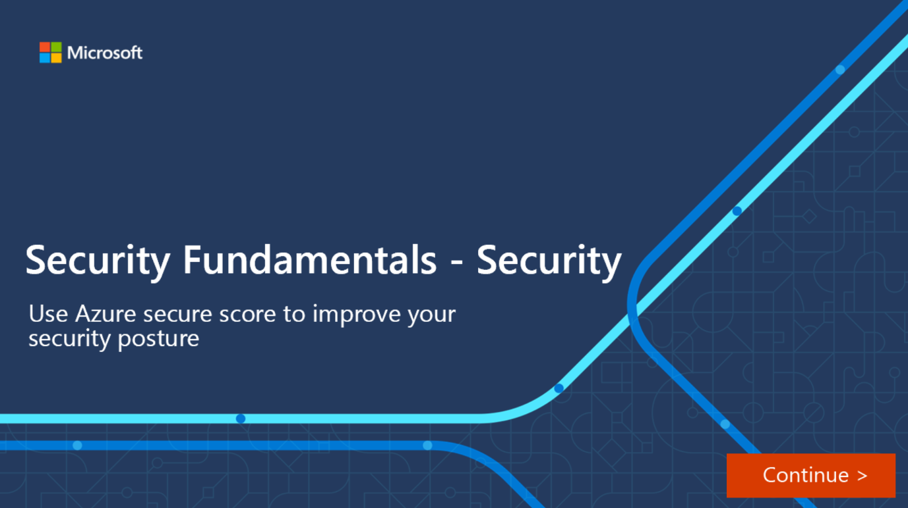

Security Center continually assesses your resources, subscriptions, and organization for security issues. It then aggregates all the findings into a single score so that you can tell, at a glance, your current security situation: the higher the score, the lower the identified risk level. 

The secure score is shown in the Azure portal pages as a percentage value. Still, the underlying values are also clearly presented:

:::image type="content" source="../media/4-overall-secuire-score.png" alt-text="Section of the Azure portal showing the Overall Secure Score.":::

To increase your security, review Security Center's recommendations page for the outstanding actions necessary to raise your score. Each recommendation includes instructions to help you remediate the specific issue.

### How is the security score calculated?

Every control in the recommendations list shows the potential secure score increase if you can address the underlying problem. To get all the possible security control points, all your resources must comply with all of the security recommendations within the security control. For example, Security Center has multiple recommendations regarding how to secure your management ports. Now, you must remediate them all to make a difference in your secure score.

For example, the security control called "Apply system updates" has a maximum score of six points, which you can see in the tooltip on the potential increase value of the control:

:::image type="content" source="../media/4-specific-recommendations.png" alt-text="Fragment of a screenshot showing a specific recommendation control and the percentage point increase will occur from fixing the issues.":::

The maximum score for this control, *Apply system updates*, is always 6. In this example, there are 50 resources. So, we divide the max score by 50, and the result is that every resource contributes 0.12 points.

- **Potential increase** (0.12 x 8 unhealthy resources = 0.96) - The remaining points available to you within the control. If you remediate all the recommendations in this control, your score will increase by 2% (in this case, 0.96 points rounded up to 1 point).
- **Current score** (0.12 x 42 healthy resources = 5.04) - The current score for this control. Each control contributes to the total score. In this example, the control is contributing 5.04 points to the current secure total.
- **Max score** - The maximum number of points you can gain by completing all recommendations within a control. The maximum score for a control indicates the relative significance of that control. Use the max score values to triage the issues to work on first.

### Improve your secure score

To improve your secure score, remediate security recommendations from your recommendations list. You can manually remediate each recommendation for each resource or by using the Quick Fix! option (when available) to quickly apply remediation for a recommendation to a group of resources.

Use secure score to keep an eye on your security posture, and easily implement actions to improve your security posture.  

### Interactive Guide

If you’re the Azure administrator for your organization, you’ll need to be aware of the security of your Azure environment and improve your security posture accordingly. The following interactive clickthrough demonstrates how you can do this using Azure secure score.  Click on the image below to get started.

