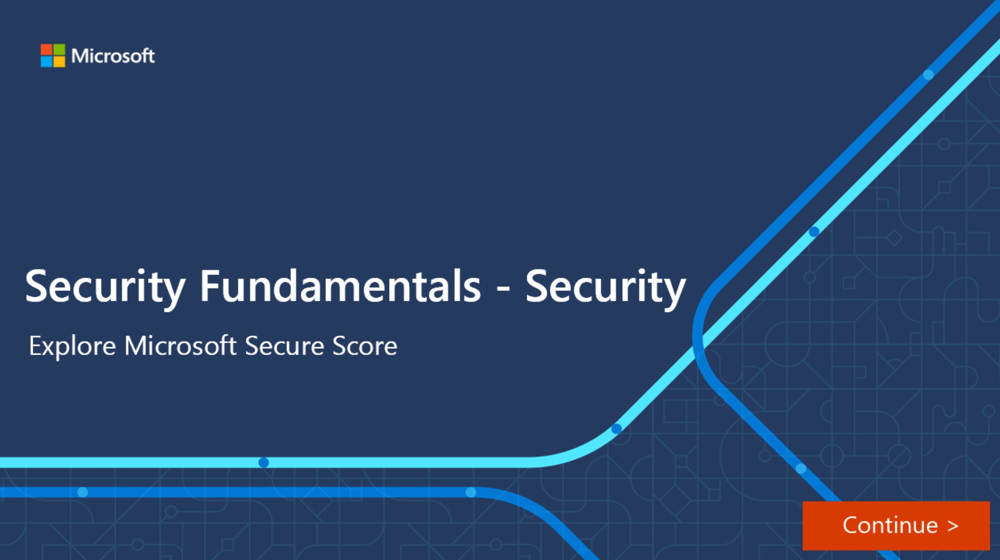

Microsoft Secure Score, one of the tools in the Microsoft security center, is a representation of a company's security posture. The higher the score, the better your protection.

Secure Score helps organizations:

- Report on the current state of their security posture.
- Improve their security posture by providing discoverability, visibility, guidance, and control.
- Compare benchmarks and establish key performance indicators (KPIs).

Points are given for the following actions:

- Configuring recommended security features.
- Doing security-related tasks.
- Addressing the improvement action with a third-party application or software, or an alternate mitigation.

Some improvement actions only give points when fully completed. Others give partial points if they're completed for some devices or users. If you can't, or don't want to, enact one of the improvement actions, you can choose to accept the risk or remaining risk.

If you have a license for one of the supported Microsoft products, you'll see related recommendations. Secure Score will show all possible improvements for the product, whatever the license edition, subscription, or plan. You'll then see all the security best practices and improvements that can be made to your score.

Your absolute security posture, represented by Secure Score, stays the same whatever licenses your organization owns for a specific product. Keep in mind that security should be balanced with usability, and not every recommendation can work for your environment.

Currently Microsoft Secure Score supports recommendations for Microsoft 365 (including Exchange Online), Azure Active Directory, Microsoft Defender for Endpoint, Microsoft Defender for Identity, and Cloud App Security. New recommendations are being added to Secure Score all the time.

In this diagram, you can see the Secure Score is 32.86%. It illustrates a breakdown of the score by points, and then shows the improvement areas that will boost your score. Finally, it provides an indication of how well your score compares to other similar organizations.

:::image type="content" source="../media/3-secure-score-overview-inline.png" lightbox="../media/3-secure-score-overview-expanded.png" alt-text="Screenshot showing a Microsoft Secure Score page, with several panels highlighted: Secure Score, Breakdown of score, implementation actions, and a comparison of the score against other organizations.":::

## Differences between the Azure and Microsoft Secure Score

There's a Secure Score for both Microsoft 365 Defender and Azure Defender, but they're subtly different. Secure Score in the Azure Security Center is a measure of the security posture of your Azure subscriptions. Secure Score in the Microsoft 365 security center is a measure of the security posture of the organization across your apps, data, devices, identity, and infrastructure.

Both the Azure and Microsoft Secure Score provide a list of steps you can take to improve your score. In Microsoft 365 Secure Score, these steps are called improvement actions. In the Azure Secure Score, scores are assessed for each subscription. The steps you can take to improve your score are called security recommendations and they're grouped into security controls.

Use Microsoft Secure Score to understand and rapidly improve your organization’s security posture.

## Interactive guide

As the Microsoft 365 admin, you need to monitor and work on the security of your organization's Microsoft 365 identities, apps, data, and devices. The following interactive click-through demonstrates how Microsoft Secure Score can help.

