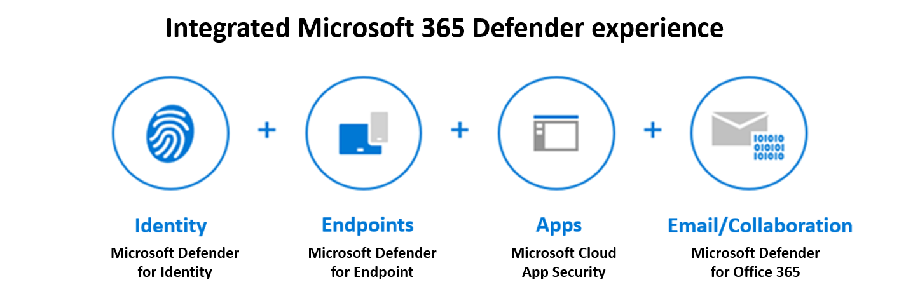

Microsoft 365 Defender is an enterprise defense suite that protects against sophisticated cyberattacks. With Microsoft 365 Defender, you can natively coordinate the detection, prevention, investigation, and response to threats across email, identity, and applications.

This short three-minute video provides an essential overview of Microsoft 365 Defender.

> [!VIDEO https://www.microsoft.com/videoplayer/embed/RE4IPYr]

Microsoft 365 Defender allows admins to assess threat signals from applications, email, and identity to determine an attack's scope and impact. It gives greater insight into how the threat occurred, and what systems have been affected. Microsoft 365 Defender can then take automated action to prevent or stop the attack.

> [!div class="mx-imgBorder"]
> 

Microsoft 365 Defender suite protects:

- **Endpoints with Microsoft Defender for Endpoint** - Microsoft Defender for Endpoint is a unified endpoint platform for preventative protection, post-breach detection, automated investigation, and response.
- **Email and collaboration with Microsoft Defender for Office 365** - Defender for Office 365 safeguards your organization against malicious threats posed by email messages, links (URLs), and collaboration tools.
- **Identities with Microsoft Defender for Identity and Azure AD Identity Protection** - Microsoft Defender for Identity uses Active Directory signals to identify, detect, and investigate advanced threats, compromised identities, and malicious insider actions directed at your organization.
- **Applications with Microsoft Cloud App Security** - Microsoft Cloud App Security is a comprehensive cross-SaaS solution that brings deep visibility, strong data controls, and enhanced threat protection to your cloud apps.

Use Microsoft Defender to protect your organization against sophisticated cyberattacks. It coordinates your detection, prevention, investigation, and response to threats across identities, email, and applications.
