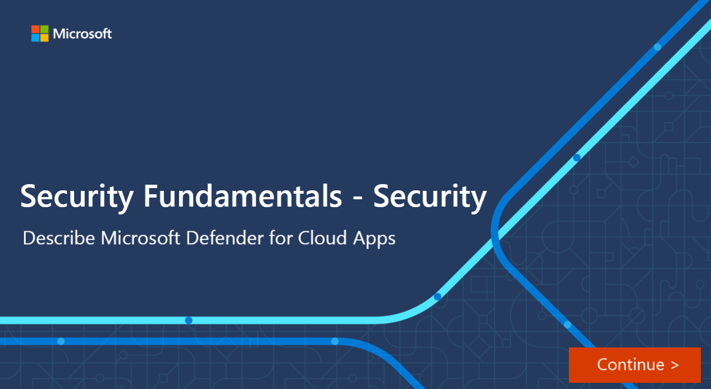

Software as a service (SaaS) apps are ubiquitous across hybrid work environments. Protecting SaaS apps and the important data they store is a significant challenge for organizations. The rise in app usage, combined with employees accessing company resources outside of the corporate perimeter has also introduced new attack vectors. To combat these attacks effectively, security teams need an approach that protects their data within cloud apps beyond the traditional scope of cloud access security brokers (CASBs).

Microsoft Defender for Cloud Apps delivers full protection for SaaS applications, helping you monitor and protect your cloud app data across the following feature areas:

- Fundamental cloud access security broker (CASB) functionality.  A CASB acts as a gatekeeper to broker real-time access between your enterprise users and the cloud resources they use. CASBs help organizations protect their environment by providing a wide range of capabilities across key functional areas including: discovery into cloud app usage and shadow IT, protection against app-based threats from anywhere in the cloud, information protection, and compliance.

- SaaS Security Posture Management (SSPM) features, enabling security teams to improve the organization’s security posture

- Advanced threat protection, as part of Microsoft's extended detection and response (XDR) solution, enabling powerful correlation of signal and visibility across the full kill chain of advanced attacks

- App-to-app protection, extending the core threat scenarios to OAuth-enabled apps that have permissions and privileges to critical data and resources.

### Discover SaaS applications

Defender for Cloud Apps shows the full picture of risks to your environment from SaaS app usage and resources, and gives you control of what’s being used and when.

- Identify: Defender for Cloud apps uses data based on an assessment of network traffic and an extensive app catalog to identify apps accessed by users across your organization.

- Assess: Evaluate discovered apps for more than 90 risk indicators, allowing you to sort through the discovered apps and assess your orgs security and compliance posture.

- Manage: Set policies that monitor apps around the clock. For example, if anomalous behavior happens, like unusual spikes in usage, you're automatically alerted and guided to action.

### Information protection

Defender for Cloud Apps connects to SaaS apps to scan for files containing sensitive data uncovering which data is stored where and who is accessing it. To protect this data, organizations can implement controls such as:

- Apply a sensitivity label
- Block downloads to an unmanaged device
- Remove external collaborators on confidential files

The Defender for Cloud Apps integration with Microsoft Purview also enables security teams to leverage out-of-the-box data classification types in their information protection policies and control sensitive information with data loss protection (DLP) features.

### SaaS Security Posture Management (SSPM)

Optimizing an organization's security posture is important, but security teams are challenged by needing to research best practices for each app individually. Defender for Cloud Apps helps by surfacing misconfigurations and recommending specific actions to strengthen the security posture for each connected app. Recommendations are based on industry standards like the Center for Internet Security and follow best practices set by the specific app provider.

Defender for Cloud Apps automatically provides SSPM data in Microsoft Secure Score, for any supported and connected app.

### Advanced threat protection

Cloud apps continue to be a target for adversaries trying to exfiltrate corporate data. Sophisticated attacks often cross modalities. Attacks often start from email as the most common entry point. then move laterally to compromise endpoints and identities, before ultimately gaining access to in-app data.

Defender for Cloud Apps offers built-in adaptive access control (AAC), provides user and entity behavior analysis (UEBA), and helps you mitigate these types of attacks.

Defender for Cloud Apps is also integrated directly into Microsoft 365 Defender, correlating eXtended detection and response (XDR) signals from the Microsoft Defender suite and providing incident-level detection, investigation, and powerful response capabilities. Integrating SaaS security into Microsoft's XDR experience gives SOC teams full kill chain visibility and improves operational efficiency and effectivity.

### App to app protection with app governance
 OAuth, an open standard for token-based authentication and authorization, enables a user's account information to be used by third-party services, without exposing the user's password. Apps that use OAuth often have extensive permissions to access data in other apps on behalf of a user, making OAuth apps susceptible to a compromise.

Defender for Cloud Apps closes the gap on OAuth app security, helping you protect inter-app data exchange with application governance. With Defender fr Cloud Apps, you can watch for unused apps and monitor both current and expired credentials to govern the apps used in your organization and maintain app hygiene.

:::image type="content" source="../media/mcas-v2-inline.png" lightbox="../media/mcas-v2-expanded.png" alt-text="Screenshot of Microsoft Defender for Cloud Apps dashboard.":::

In this interactive guide, you’ll get an introduction to the capabilities available with Microsoft Defender for Cloud Apps. Select the image to get started and follow the prompts on the screen.

