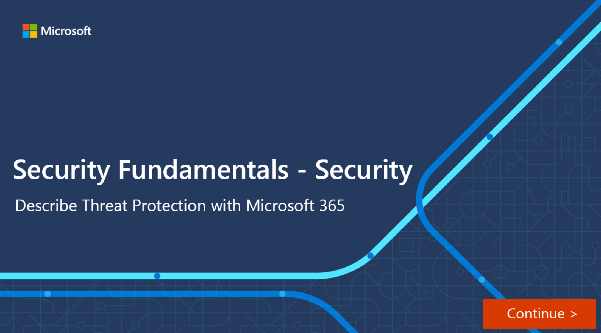

Moving to the cloud increases flexibility for employees and IT teams. However, it also introduces new challenges and complexities for keeping your organization secure. To get the full benefit of cloud apps and services, an IT team must find the right balance of supporting access while protecting critical data.

Microsoft Cloud App Security (MCAS) is a Cloud Access security broker (CASB). It is a comprehensive cross-SaaS solution that operates as an intermediary between a cloud user and the cloud provider to provide rich visibility to your cloud services, control over data travel, and sophisticated analytics to identify and combat cyber threats across all your Microsoft and third-party cloud services. With this service, you can gain visibility into Shadow IT by discovering cloud apps in use. You can control and protect data in the apps once you sanction them to the service.

## What is CASB?

A CASBs acts as a gatekeeper to broker access in real time between your enterprise users and cloud resources they use, wherever your users are located, and regardless of the device, they are using.  

CASBs address security gaps in an organization’s use of cloud services and protect the organization by providing a wide array of capabilities across the following areas: **Visibility** to detect all cloud services, **Data security**, **Threat protection**, and **compliance**. These capability areas represent the basis of the Cloud App Security framework described below.

## The Cloud App Security framework

MCAS is built on a framework that provides the following capability:

- **Discover and control the use of Shadow IT**: Identify the cloud apps, IaaS, and PaaS services used by your organization. Investigate usage patterns, assess the risk levels and business readiness of more than 16,000 SaaS apps against more than 80 risks.
- **Protect your sensitive information** **anywhere in the cloud**: Understand, classify, and protect the exposure of sensitive information at rest—leverage out-of-the-box policies and automated processes to apply controls in real-time across all your cloud apps.
- **Protect against cyber threats and anomalies**: Detect unusual behavior across cloud apps to identify ransomware, compromised users, or rogue applications, analyze high-risk usage, and remediate automatically to limit the risk to your organization.
- **Assess your cloud apps' compliance**: Assess if your cloud apps meet relevant compliance requirements, including regulatory compliance and industry standards. Prevent data leaks to non-compliant apps and limit access to regulated data.

## Microsoft Cloud App Security Architecture

Cloud App security isn’t only about how you strengthen or harden your servers, and detect and prevent cyberattacks. It requires consideration about the architecture of your entire estate. How each server connects to its neighbor, and the routes that network traffic take can make a substantial to difference your security model. Cloud App Security integrates visibility with your cloud by:

- Using Cloud Discovery to map and identify your cloud environment and the cloud apps your organization is using. Cloud Discovery uses your traffic logs to dynamically discover and analyze the cloud apps that your organization is using.
- Sanctioning and un-sanctioning apps in your cloud, which you can use Cloud App Security to sanction or unsanctioned apps in your organization by using the Cloud app catalog. That includes over 16,000 cloud apps that are ranked and scored based on industry standards.
- Using easy-to-deploy app connectors that take advantage of provider APIs for visibility and governance of apps you connect to. App connectors use APIs from cloud app providers to integrate their cloud apps with MCAS. App connectors extend control and protection. They also give you access to information directly from cloud apps, for Cloud App Security analysis.
- Using Conditional Access App Control protection to get real-time visibility and control over access and activities within your cloud apps.
- Helping you have continuous control by setting and then continually fine-tuning policies, you can use policies to define your users' behavior in the cloud. Use policies to detect risky behavior, violations, or suspicious data points and activities in your cloud environment.

:::image type="content" source="../media/6-cloud-app-security-intermediary.png" alt-text="Diagram showing how Cloud App Security acts as an intermediary, checking and verifying cloud apps usage.":::

## Office 365 Cloud App Security

Office 365 Cloud App Security is a subset of Microsoft Cloud App Security that provides enhanced visibility and control for Office 365. Office 365 Cloud App Security includes threat detection based on user activity logs, discovery of Shadow IT for apps that have similar functionality to Office 365 offerings, control app permissions to Office 365, and apply access and session controls.

It provides a subset of the core MCAS features.

## Enhanced Cloud App Discovery in Azure Active Directory

Azure Active Directory Premium P1 includes Azure Active Directory Cloud App Discovery at no additional cost. This feature is based on the Microsoft Cloud App Security Cloud Discovery capabilities that provide deeper visibility into cloud app usage in your organizations.

It provides a reduced subset of the MCAS discovery capabilities.

Use Microsoft Cloud App Security to intelligently and proactively identify and respond to threats across your organization's Microsoft and non-Microsoft cloud services.

## Interactive Guide

In this interactive guide, you’ll get an introduction to the many services and capabilities available through the Cloud App Security portal, including Discover, Investigate, Control, and Alerts.

To navigate this interactive guide, follow the prompts on the screen.

