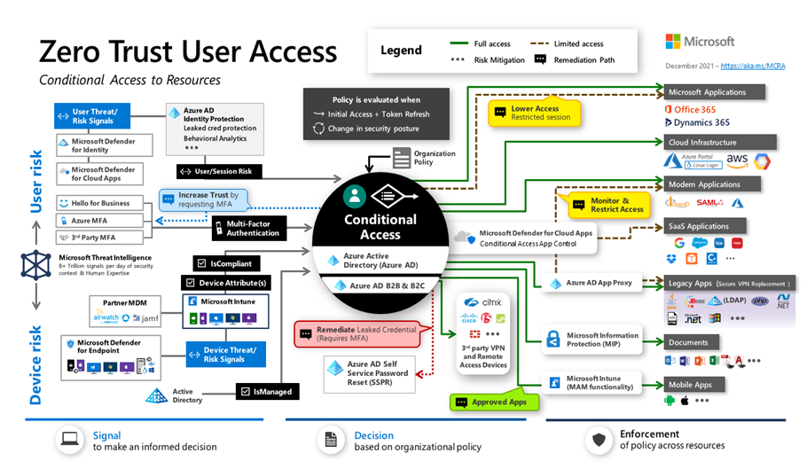

**Case Study: Design an Identity Security Solution**

### Meet Tailwind Traders

Tailwind Trader is a fictitious home improvement retailer. It operates
retail hardware stores across the globe and online. The Tailwind Traders
CISO is aware of the opportunities offered by Azure but also understands
the need for strong security and solid cloud architecture. Without
strong security and a great point of reference architecture, the company
may have difficulty managing the Azure environment and costs, which are
hard to track and control. The CISO is interested in understanding how
Azure manages and enforces security standards.

### Requirements

Tailwind Traders is planning on making some significant changes to their
Identity Security Strategy. They have asked for your assistance with
recommendations and questions. Here are the specific requirements.

**Conditional Access.** The company has a new security optimization project for customer environments. The CISO wants to ensure that all available Privileged Users are controlled in the cloud.

### Tasks

1.  **Conditional Access** - What could Tailwind Traders do to enforce Privileged Users to
        require MFA for all cloud access?
    1. Evaluate a solution and explain your decision-making process.
    1. Create a Conditional Access Policy that enforces all Global Administrators to require MFA.
    1. What could Tailwind Traders do to review administrators' access regularly to ensure only the right people have continued access to Azure resources?
    1. Configure recurring access reviews to revoke unneeded permissions over time.

How are you enforcing Identity Security for all users to protect their data, applications, and other assets in Microsoft Azure?