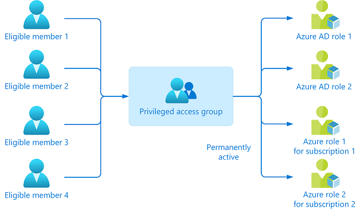

## Why assign roles to groups?

Azure Active Directory (Azure AD) lets you target Azure AD groups for role assignments. Assigning roles to groups can simplify the management of role assignments in Azure AD with minimal effort from your Global Administrators and Privileged Role Administrators.

Consider the example where the Contoso company has hired people across geographies to manage and reset passwords for employees in its Azure AD organization. Instead of asking a Privileged Role Administrator or Global Administrator to assign the Helpdesk Administrator role to each
person individually, they can create a Contoso_Helpdesk_Administrators group and assign the role to the group. When people join the group, they're assigned the role indirectly. Your existing governance workflow can then take care of the approval process and auditing of the group's
membership to ensure that only legitimate users are members of the group and are thus assigned the Helpdesk Administrator role.

## Use PIM to make a group eligible for a role assignment

If you don't want members of the group to have standing access to a role, you can use [Azure AD Privileged Identity Management (PIM)](/azure/active-directory/privileged-identity-management/pim-configure) to make a group eligible for a role assignment. Each member of the group is then eligible to activate the role assignment for a fixed time duration.

## Best practices for Azure AD roles

This section describes some of the best practices for using Azure Active
Directory role-based access control (Azure AD RBAC).

### Manage to least privilege

When planning your access control strategy, it's a best practice to
manage to least privilege. Least privilege means you grant your
administrators exactly the permission they need to do their job. There
are three aspects to consider when you assign a role to your
administrators: a specific set of permissions, over a specific scope,
for a specific period of time. Avoid assigning broader roles at broader
scopes even if it initially seems more convenient to do so. By limiting
roles and scopes, you limit what resources are at risk if the security
principle is ever compromised. Azure AD RBAC supports over 65 [built-in roles](/azure/active-directory/roles/permissions-reference).
There are Azure AD roles to manage directory objects like users, groups,
and applications, and also to manage Microsoft 365 services like
Exchange, SharePoint, and Intune.

### Use Privileged Identity Management to grant just-in-time access

One of the principles of least privilege is that access should be
granted only for a specific period of time. [Azure AD Privileged Identity Management (PIM)](/azure/active-directory/privileged-identity-management/pim-configure) lets
you grant just-in-time access to your administrators. Microsoft
recommends that you enable PIM in Azure AD. Using PIM, a user can be
made an eligible member of an Azure AD role where they can then activate
the role for a limited time when needed. Privileged access is
automatically removed when the timeframe expires. You can
also [configure PIM settings](/azure/active-directory/privileged-identity-management/pim-how-to-change-default-settings) to
require approval or receive notification emails when someone activates
their role assignment. Notifications provide an alert when new users are
added to highly privileged roles.

### Turn on multifactor authentication (MFA) for all administrator accounts

[Based on our studies](https://techcommunity.microsoft.com/t5/azure-active-directory-identity/your-pa-word-doesn-t-matter/ba-p/731984), your account is 99.9% less likely to be compromised if you use multifactor authentication (MFA).

You can enable MFA on Azure AD roles using two methods:

-   [Role settings](/azure/active-directory/privileged-identity-management/pim-how-to-change-default-settings) in Privileged Identity Management
-   [Conditional Access](/azure/active-directory/conditional-access/howto-conditional-access-policy-admin-mfa)

### Configure recurring access reviews to revoke unneeded permissions over time

Access reviews enable organizations to review administrators' access
regularly to make sure only the right people have continued access.
Regular auditing of your administrators is crucial because of the
following reasons:

-   A malicious actor can compromise an account.
-   People move teams within a company. If there's no auditing, they can amass unnecessary access over time.

For information about access reviews for roles, see [Create an access review of Azure AD roles in PIM](/azure/active-directory/privileged-identity-management/pim-create-azure-ad-roles-and-resource-roles-review). For information about access reviews of groups that are assigned roles, see [Create an access review of groups and applications in Azure AD access reviews](/azure/active-directory/governance/create-access-review).

### Limit the number of global administrators to less than five

As a best practice, Microsoft recommends that you assign the Global
Administrator role to **fewer than five** people in your organization.
Global Administrators hold keys to the kingdom, and it is in your best
interest to keep the attack surface low. As stated previously, all of
these accounts should be protected with multifactor authentication.

Microsoft recommends that you keep two break glass accounts that are
permanently assigned to the Global Administrator role. Make sure that
these accounts don't require the same multifactor authentication
mechanism as your normal administrative accounts to sign in, as
described in [Manage emergency access accounts in Azure AD](/azure/active-directory/roles/security-emergency-access).

### Use groups for Azure AD role assignments and delegate the role assignment

If you have an external governance system that takes advantage of
groups, then you should consider assigning roles to Azure AD groups
instead of individual users. You can also manage role-assignable groups
in PIM to ensure that there are no standing owners or members in these
privileged groups. For more information, see [Management capabilities for privileged access Azure AD groups](/azure/active-directory/privileged-identity-management/groups-features).

You can assign an owner to role-assignable groups. That owner decides
who is added to or removed from the group, so indirectly, decides who
gets the role assignment. A Global Administrator or Privileged Role
Administrator can delegate role management on a per-role basis by using
groups. For more information, see [Use Azure AD groups to manage role assignments](/azure/active-directory/roles/groups-concept).

### Activate multiple roles at once using privileged access groups

It may be the case that an individual has five or six eligible
assignments to Azure AD roles through PIM. They'll have to activate
each role individually, which can reduce productivity. Worse still, they
can also have tens or hundreds of Azure resources assigned to them,
which aggravates the problem.

In this case, you should use [privileged access groups](/azure/active-directory/privileged-identity-management/groups-features). Create a privileged access group and grant it permanent access to multiple roles (Azure AD and/or Azure). Make that user an eligible
member or owner of this group. With just one activation, they'll have access to all the linked resources.

 

### Use cloud native accounts for Azure AD roles

Avoid using on-premises synced accounts for Azure AD role assignments.
If your on-premises account is compromised, it can compromise your Azure
AD resources as well.

## Why enforce delegation?

To understand how to delegate access governance in entitlement
management, it helps to consider an example. Suppose an organization has
the following administrator and managers.

Hana is the IT administrator. They have contacts in each department who are responsible for
their department's resources and business critical content: Mamta in Marketing, Mark in Finance, and Joe in Legal.

With entitlement management, access governance can be delegated to these
non-administrators because they're the ones who know which users need
access, for how long, and to which resources. Delegating to
non-administrators ensures the right people are managing access for
their departments.